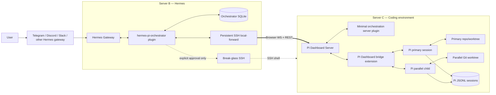
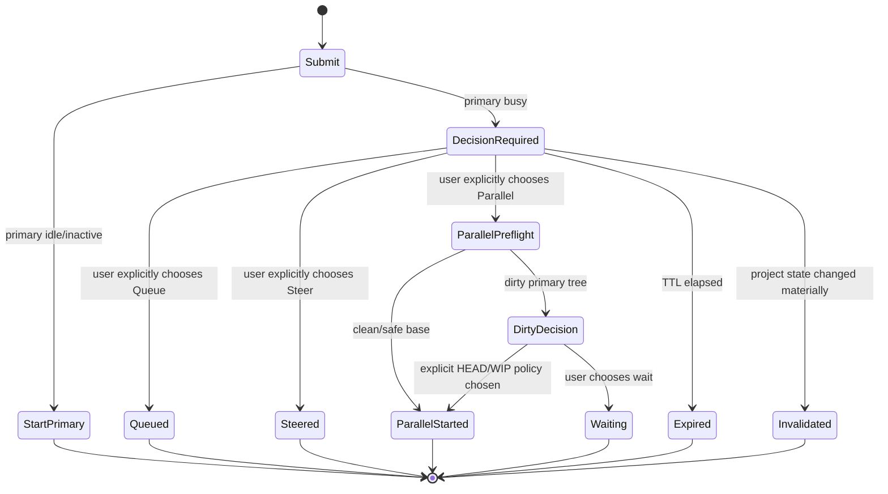
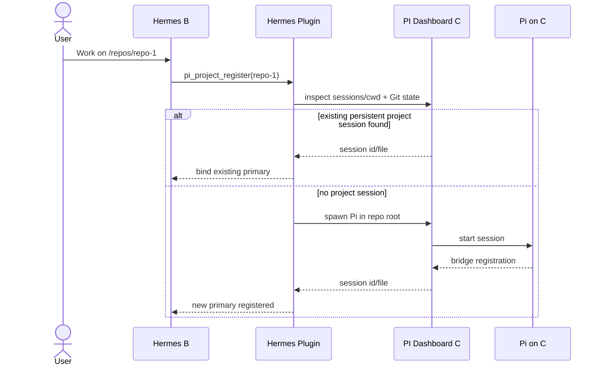
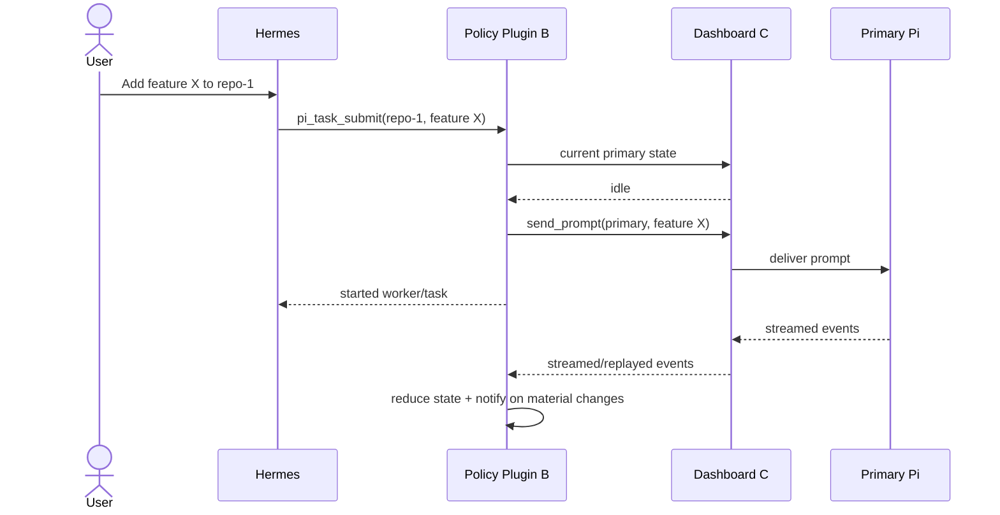
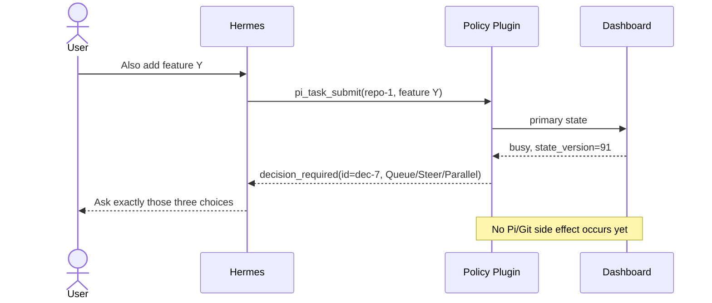
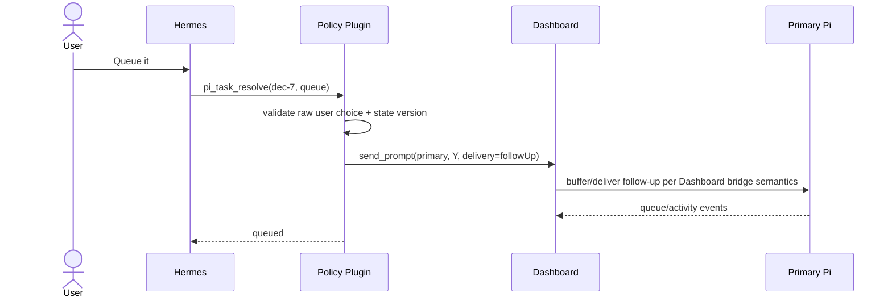
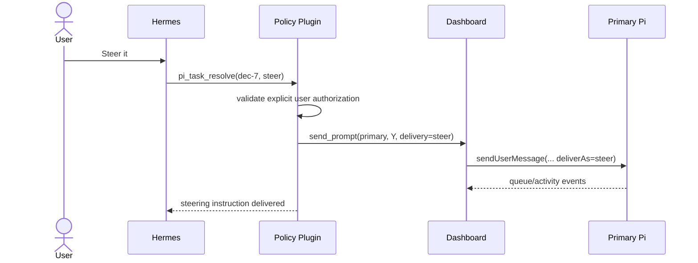
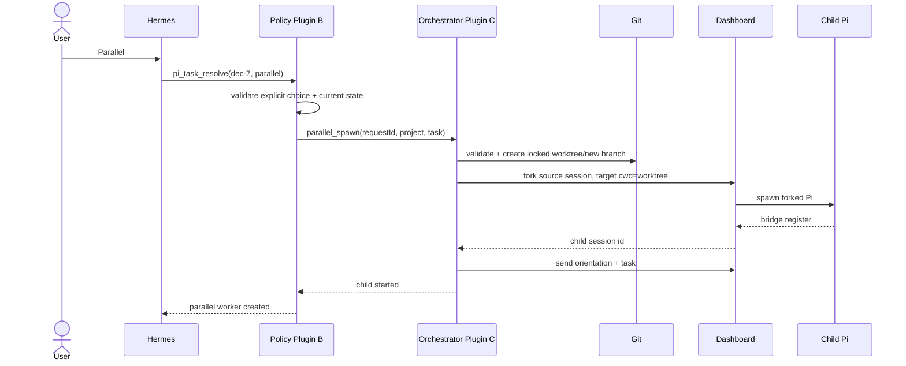
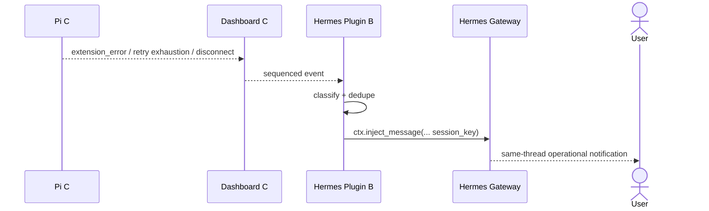

# Hermes Pi Orchestrator — Software Design Specification

**Repository name:** `hermes-pi-orchestrator`  
**Repository description:** Human-gated orchestration for persistent Pi coding sessions, parallel Git worktrees, observability, and recovery through Hermes and PI Dashboard.  
**Document status:** Proposed design / implementation blueprint  
**Primary deployment:** Server B = Hermes Gateway; Server C = Pi coding environment + PI Dashboard  
**Scope:** Server C integration only. Machine A is explicitly out of scope for the first implementation.

---

## Table of contents

1. [Executive summary](#1-executive-summary)
2. [Why this architecture](#2-why-this-architecture)
3. [Goals](#3-goals)
4. [Non-goals for v1](#4-non-goals-for-v1)
5. [Repository strategy](#5-repository-strategy)
6. [Proposed repository layout](#6-proposed-repository-layout)
7. [System context](#7-system-context)
8. [Architectural invariants](#8-architectural-invariants)
9. [Functional requirements](#9-functional-requirements)
10. [Nonfunctional requirements](#10-nonfunctional-requirements)
11. [State model](#11-state-model)
12. [Mandatory human concurrency gate](#12-mandatory-human-concurrency-gate)
13. [Server B: Hermes integration plugin](#13-server-b-hermes-integration-plugin)
14. [Server C: PI Dashboard fork integration](#14-server-c-pi-dashboard-fork-integration)
15. [B-to-C transport](#15-b-to-c-transport)
16. [End-to-end workflows and sequence diagrams](#16-end-to-end-workflows-and-sequence-diagrams)
17. [Project, session, worker, and worktree model](#17-project-session-worker-and-worktree-model)
18. [Durable state and restart recovery](#18-durable-state-and-restart-recovery)
19. [Observability and event reduction](#19-observability-and-event-reduction)
20. [Pi extension compatibility plan](#20-pi-extension-compatibility-plan)
21. [Proactive notifications](#21-proactive-notifications)
22. [Break-glass recovery design](#22-break-glass-recovery-design)
23. [Security and threat model](#23-security-and-threat-model)
24. [Failure and recovery matrix](#24-failure-and-recovery-matrix)
25. [Context-efficiency budget](#25-context-efficiency-budget)
26. [Configuration design](#26-configuration-design)
27. [Deployment design](#27-deployment-design)
28. [Testing strategy](#28-testing-strategy)
29. [CI/CD and upstream synchronization](#29-cicd-and-upstream-synchronization)
30. [Implementation phases](#30-implementation-phases)
31. [Acceptance criteria / Definition of Done](#31-acceptance-criteria--definition-of-done)
32. [Known risks and questions to prove during implementation](#32-known-risks-and-questions-to-prove-during-implementation)
33. [Future roadmap](#33-future-roadmap)
34. [Architecture decision records (ADR summary)](#34-architecture-decision-records-adr-summary)
35. [Source research and implementation references](#35-source-research-and-implementation-references)

Appendices: [README summary](#appendix-a---initial-repository-readme-summary) | [First implementation issue set](#appendix-b---recommended-first-implementation-issue-set) | [Code-review checklist](#appendix-c---design-principle-checklist-for-code-review)

---

## 1. Executive summary

`hermes-pi-orchestrator` will turn Hermes on Server B into the supervisory interface for the user's existing Pi development workflow on Server C without replacing Pi, flattening Pi into stateless tasks, or forcing the user to abandon long-lived project sessions.

The selected architecture deliberately **does not build a new `pi-manager` or a second Pi RPC hub**. PI Dashboard already contains most of the hard infrastructure that such a manager would need: a Pi bridge extension, multi-session registry, durable session discovery, process spawning and recovery, event replay, prompt routing, queue/steer behavior, session history, Git/worktree management, integrated diagnostics, and a browser protocol intended for remote clients. PI Dashboard's own July 2026 design exploration independently concluded that a chat gateway should be implemented as a **headless Dashboard browser-protocol client**, not as another controller that spawns its own Pi RPC processes.

The architecture therefore has three primary pieces:

1. **PI Dashboard fork on Server C** — retained as the authoritative session/process/event hub. The fork should stay as close to upstream as possible.
2. **Hermes Orchestrator plugin on Server B** — a Python Hermes plugin that acts as a headless PI Dashboard client, keeps the small amount of user-policy state PI Dashboard does not own, exposes a compact tool surface to Hermes, reduces raw Pi events into low-context status, and proactively injects important updates back into the same Hermes gateway conversation.
3. **A minimal Dashboard-side orchestration plugin/patch** — only for operations that need to be atomic on C and are not cleanly representable by current Dashboard APIs, principally: **create an isolated Git worktree and fork an existing Pi session into that worktree's cwd as one transaction**. General Pi lifecycle, event collection, queueing, steering, history, and process recovery remain PI Dashboard responsibilities.

A separate **break-glass SSH path** gives Hermes approved direct access to Server C when Dashboard or the orchestration layer itself is broken. This path is deliberately not the normal interface and is guarded by explicit user approval, a short-lived lease, and an audit trail.

The most important behavioral invariant is human control of concurrency:

> If a request arrives for a project whose primary Pi session is already busy, the system MUST NOT decide whether to queue, steer, or parallelize. It MUST return a pending decision and ask the user to choose: **Queue**, **Steer**, or **Parallel**. No side effect may occur until the user's subsequent message unambiguously authorizes one choice.

This requirement is enforced mechanically in plugin code, not merely in a prompt given to Hermes.

---

## 2. Why this architecture

### 2.1 What PI Dashboard already solves

Current PI Dashboard is a monorepo with a bridge extension that runs in Pi sessions, a Node/Fastify server, a React web client, shared wire-protocol packages, and a first-party plugin runtime. It supports multiple Pi sessions, headless or tmux spawning, live event streaming, event replay, PromptBus interaction, session resume/fork, Git/worktree operations, process health, provider/runtime diagnostics, and an MCP endpoint. Its bridge forwards Pi lifecycle and tool events to the server and replays session entries after reconnect. The server maintains the runtime session registry while Pi's JSONL session files remain the durable conversation source of truth.

The most important source-level observations for this project are:

- The browser WebSocket protocol already exposes `send_prompt` with `delivery?: "steer" | "followUp"`.
- The bridge handles steering and follow-up differently. While a session is streaming, `steer` calls Pi's `sendUserMessage(..., { deliverAs: "steer" })`; Dashboard-owned follow-ups are buffered and drained as fresh turns after Pi reaches the appropriate idle boundary.
- The bridge uses Pi's `agent_settled` event as the terminal signal for a retry chain instead of equating `agent_end` with complete settlement.
- Browser subscriptions have sequence numbers and replay/backfill semantics, so a headless client can reconnect without re-reading an entire project history.
- Session registration contains cwd, session file, process identity, model, thinking level, source, and spawn correlation metadata.
- Spawn correlation tokens and request IDs exist specifically to prevent same-cwd fork/spawn races.
- The resume path guards against duplicate writers by checking both session identity and the underlying `sessionFile`.
- PI Dashboard now has explicit worktree management and executes sensitive Git worktree operations in argv form instead of interpolating shell strings.
- PI Dashboard's own `chat-gateway-exploration.md` states the architectural conclusion: **"chat gateway = headless dashboard client"** and recommends reuse of Dashboard's existing hub rather than another RPC daemon.

These are exactly the primitives required here.

### 2.2 What `hermes-pi-bridge` contributes

`szabo-agent/hermes-pi-bridge` is the closest literal prior art. It implements a Hermes plugin whose stated model is "Hermes orchestrates; pi executes," exposes Pi task/session tools, launches persistent Pi RPC sessions, distinguishes `steer` from `followUp`, and asynchronously calls Hermes `ctx.inject_message` when work finishes.

It is useful as a **Hermes-side design reference**, but not as the execution substrate for this deployment because it:

- assumes Pi is local to the Hermes host;
- creates its own Pi subprocess/RPC lifecycle instead of using PI Dashboard's richer control plane;
- stores important runtime state in memory;
- is centered on task/session lifecycle owned by the plugin rather than a separate C-side session hub;
- describes RPC prompt response as the completion signal, whereas current Pi/PI Dashboard use `agent_settled` to represent true terminal settlement after retry/compaction/follow-up behavior;
- contains automatic coding-task delegation behavior that conflicts with the user's required manual concurrency policy.

What should be reused conceptually is its small Hermes tool surface, Python plugin organization, async notification pattern, and vocabulary. What should not be reused is its local Pi subprocess manager.

### 2.3 Why not direct Pi RPC from B

Pi RPC is powerful and well documented, but a direct B→SSH→`pi --mode rpc` design would re-create session/process supervision, reconnect behavior, event buffering, TUI coexistence, session discovery, spawn correlation, worktree management, and observability that PI Dashboard already implements. It would also create a second source of truth for Pi process ownership.

PI Dashboard should remain the sole runtime hub on C.

### 2.4 Why not use Dashboard MCP as the primary transport

PI Dashboard's MCP endpoint is useful and may become a secondary compatibility surface, but the Dashboard browser protocol is currently a better fit for this project because it exposes the full session subscription/event model, prompt delivery semantics, prompt requests, replay, queue state, and session lifecycle that its own browser uses. The project's exact requirements are closer to "headless Dashboard UI client" than "generic MCP consumer."

The Hermes plugin should therefore use:

- **Browser WebSocket protocol** for live session state, subscriptions, events, prompt delivery, abort, and session action responses.
- **Dashboard REST endpoints** for health, bounded historical/diagnostic reads, and existing worktree/server operations that are easier over HTTP.
- **One small custom Dashboard endpoint/plugin operation** only where an atomic operation is missing.

---

## 3. Goals

### G1 — Preserve one persistent primary Pi session per project

A repository/project should normally map to one durable Pi session that accumulates the project's implementation history, context-management behavior, and long-term cost/token accounting.

If its process dies or becomes inactive, the orchestrator resumes the same session file. It does not create a new primary session simply because the process is gone.

### G2 — Human-gated concurrency every time

When the primary session is actively working and a new feature/task arrives for the same project, Hermes must present exactly three conceptual choices:

1. **Queue** — keep the current run intact and execute the new request afterward.
2. **Steer** — redirect the current active session toward the new instruction.
3. **Parallel** — create an isolated Git worktree/branch and temporary child Pi session for the new task.

Hermes may explain the consequences, but **must not choose for the user**.

### G3 — High observability with low model-context cost

Hermes should normally see a compact state summary rather than raw Pi history. The system should retain access to:

- current worker/session phase;
- current or last tool/action;
- files being edited or recently changed;
- latest significant test/lint/build result;
- queued steering/follow-up state;
- context usage and cumulative session cost/tokens;
- Pi extension statuses when available;
- retry/wait/quota states;
- nonfatal errors and extension errors;
- process/session connectivity.

Raw events/history/logs remain available through explicit bounded diagnostic tools.

### G4 — Proactive same-thread updates

Meaningful state changes should wake Hermes and produce a message in the same gateway conversation that initiated or owns the work. The user should not need to poll "is it done?" or "what happened?"

### G5 — Preserve Pi extension behavior

Existing Pi extensions such as `pi-relay`, `magic-context`, and `lazy-tools` must remain installed on C and run in the same Pi process as normal. The architecture must not require replacing Pi with a stripped-down worker mode that bypasses those extensions.

### G6 — Safe parallel development

Parallel work must use separate Git worktrees and separate Pi session files. Two workers may never share a writable working tree or simultaneously write the same Pi session file.

### G7 — Recoverability

Dashboard, the Hermes plugin, the SSH tunnel, and Pi processes may restart independently. The system must reconstruct enough state from durable sources to continue safely without replaying ambiguous side effects.

### G8 — Break-glass operator recovery

If normal control surfaces fail, Hermes may request explicit user authorization for direct SSH diagnosis/repair on C. This should be powerful enough to inspect/fix Dashboard, orchestration code, Pi processes, session files, Git state, and service configuration.

---

## 4. Non-goals for v1

- Controlling Machine A.
- Replacing PI Dashboard's web UI.
- Building a general multi-host agent fleet manager.
- Replacing Pi's own extension ecosystem or context/session system.
- Automatic queue-vs-steer-vs-parallel decisions.
- Automatic merging of parallel branches without a user-authorized integration action.
- Re-implementing Pi RPC in Python.
- Publicly exposing Dashboard on the Internet.
- Using raw terminal/tmux automation as the primary Pi control surface.
- Automatically reading the user's entire Pi session history into Hermes context.
- Treating Hermes' LLM reasoning as a security boundary.

---

## 5. Repository strategy

### 5.1 Repository identity

**Name:** `hermes-pi-orchestrator`

**Short GitHub description:**

> Human-gated orchestration for persistent Pi coding sessions, parallel Git worktrees, observability, and recovery through Hermes and PI Dashboard.

### 5.2 Fork strategy

The repository should begin as a **GitHub fork of `BlackBeltTechnology/pi-agent-dashboard`**, preserving its history. Rename the fork/repository to `hermes-pi-orchestrator` if GitHub/account policy permits, and configure:

```text
origin   -> our hermes-pi-orchestrator fork
upstream -> BlackBeltTechnology/pi-agent-dashboard
```

Do not create a new repository and place PI Dashboard inside it as a Git submodule. PI Dashboard is already a large monorepo with first-party plugin discovery designed for additional `packages/*` workspaces. Keeping its history makes future upstream sync, `git range-diff`, conflict analysis, and selective contribution upstream substantially easier.

The first commit unique to this project should add `docs/upstream.md` containing:

- upstream URL;
- exact pinned upstream commit SHA;
- upstream release/tag from which the fork started;
- date pinned;
- known local patches;
- update/sync procedure.

As of the research date, PI Dashboard's latest GitHub release is **v0.8.0, released August 26, 2026, commit `0498509`**, while the `develop` branch contains additional unreleased work. The recommended initial production baseline is this v0.8.0 tag because source inspection confirms it already contains the browser `lastSeq` replay cursor, explicit `delivery?: "steer" | "followUp"`, spawn correlation/error diagnostics, and the bridge-owned follow-up queue semantics required here. Development may selectively port later fixes only after tests justify them; production must pin an exact reviewed SHA rather than follow `develop`.

### 5.3 Minimize fork divergence

Local changes should fall into one of three categories:

1. **New monorepo packages** — preferred; no upstream core modification.
2. **Small additive protocol/API changes** — acceptable when the required primitive is impossible through plugin APIs.
3. **Core behavioral patches** — last resort; each requires an ADR and upstream-sync test coverage.

Where a local change is generally useful to PI Dashboard, open an upstream issue/PR and remove the fork patch after upstream adoption.

---

## 6. Proposed repository layout

```text
hermes-pi-orchestrator/
├── .github/
│   └── workflows/
│       ├── upstream-drift.yml
│       ├── orchestrator-tests.yml
│       └── security-checks.yml
│
├── packages/
│   ├── ... all upstream PI Dashboard packages ...
│   │
│   └── hermes-orchestrator-plugin/
│       ├── package.json
│       ├── configSchema.json
│       ├── src/
│       │   ├── server/
│       │   │   ├── index.ts
│       │   │   ├── parallel-spawn.ts
│       │   │   ├── diagnostics.ts
│       │   │   ├── project-metadata.ts
│       │   │   └── schemas.ts
│       │   └── bridge/
│       │       └── index.ts           # optional; only if Pi extension-state adapter is needed
│       └── test/
│
├── integrations/
│   └── hermes-plugin/
│       ├── plugin.yaml
│       ├── __init__.py
│       ├── schemas.py
│       ├── tools.py
│       ├── config.py
│       ├── dashboard_client.py
│       ├── dashboard_ws.py
│       ├── dashboard_rest.py
│       ├── event_reducer.py
│       ├── project_store.py
│       ├── decision_gate.py
│       ├── task_service.py
│       ├── notifications.py
│       ├── diagnostics.py
│       ├── breakglass.py
│       ├── redaction.py
│       ├── migrations/
│       └── tests/
│
├── services/
│   ├── server-b/
│   │   ├── hermes-pi-tunnel.service
│   │   ├── ssh_config.example
│   │   └── hermes-config.example.yaml
│   └── server-c/
│       ├── pi-dashboard.service.example
│       ├── dashboard-config.example.json
│       └── authorized_keys.example
│
├── scripts/
│   ├── install-server-b.sh
│   ├── install-server-c.sh
│   ├── sync-upstream.sh
│   ├── smoke-test.sh
│   └── extension-compat-audit.sh
│
├── tests/
│   ├── contract/
│   │   ├── browser-protocol/
│   │   └── dashboard-rest/
│   ├── integration/
│   │   ├── fake-dashboard/
│   │   └── fake-hermes/
│   └── e2e/
│       ├── primary-session.spec.ts
│       ├── queue-steer-parallel.spec.ts
│       ├── worktree-fork.spec.ts
│       ├── restart-recovery.spec.ts
│       ├── notification-routing.spec.ts
│       └── extension-compat.spec.ts
│
├── docs/
│   ├── SOFTWARE_DESIGN_SPEC.md
│   ├── upstream.md
│   ├── operations.md
│   ├── security.md
│   ├── protocol-notes.md
│   └── adr/
│       ├── 0001-headless-dashboard-client.md
│       ├── 0002-human-concurrency-gate.md
│       ├── 0003-minimal-dashboard-fork.md
│       ├── 0004-worktree-session-fork-transaction.md
│       └── 0005-breakglass-access.md
│
└── ... upstream PI Dashboard root files ...
```

The Hermes integration remains Python because Hermes plugins are Python and should load directly into the Hermes process. The C-side package remains TypeScript because it runs inside PI Dashboard's existing Node/TypeScript monorepo.

---

## 7. System context



### 7.1 Responsibility boundaries

| Component | Owns | Must not own |
| --- | --- | --- |
| Hermes | natural-language planning, conversation, user-facing choices and explanations | raw Pi process lifecycle |
| Hermes orchestrator plugin | project/session mapping, human gate, compact status reducer, routing, notification policy, break-glass lease | Pi session JSONL, Git implementation details that Dashboard already owns |
| PI Dashboard | Pi session registry, bridges, process spawning, live events, history/replay, worktree primitives, server diagnostics | user concurrency policy |
| Minimal Dashboard orchestration plugin | atomic C-side operations absent upstream, especially worktree+fork transaction | a second session manager |
| Pi | coding/reasoning/tool execution and persistent conversation | cross-project orchestration |
| Git | code history, branch/worktree isolation | conversational state |

---

## 8. Architectural invariants

These are requirements, not preferences.

### INV-1 — One primary session binding per project

A project has at most one `primary_session_file` and one current `primary_dashboard_session_id`. The Dashboard session ID may change when a process is resumed/re-registered; the Pi session file binding remains the durable identity.

### INV-2 — Never create a new primary session merely because the primary process stopped

If the primary Pi process is inactive but the session file is healthy, resume the same session.

### INV-3 — One writer per Pi session file

Before resuming/forking, rely on PI Dashboard's session-file contention guards and add orchestrator-level checks. Parallel children always receive a new Pi session file.

### INV-4 — One active worker per writable worktree

No two Pi workers may be assigned to the same writable Git worktree simultaneously.

### INV-5 — Busy project requests are side-effect-free until human choice

`pi_task_submit()` cannot accept `queue`, `steer`, or `parallel` as an argument. If the primary is busy, it returns a pending decision and performs no prompt delivery, branch creation, worktree creation, or session spawning.

### INV-6 — Decision resolution requires a later user turn

Hermes cannot create a conflict and resolve it in the same agent turn.

### INV-7 — Decision resolution requires explicit user evidence

The plugin checks the raw user message for an unambiguous choice. LLM tool intent alone is insufficient authorization.

### INV-8 — Parallel is isolated by both Git and Pi session identity

A parallel child receives a unique branch, worktree path, Pi session file, task ID, and Dashboard session ID.

### INV-9 — Dashboard is the Pi runtime source of truth

The Hermes plugin may cache/reduce state, but does not claim a Pi worker is active solely because its SQLite row says so. Live Dashboard snapshots/events determine current process/session status.

### INV-10 — Pi JSONL is the durable conversation truth

The orchestrator does not copy entire Pi transcripts into its own database.

### INV-11 — Raw context is pull-only

Raw session entries, stderr, or logs are never automatically stuffed into Hermes context. Diagnostic tools require explicit bounded limits.

### INV-12 — Break-glass cannot silently activate

Direct repair access requires an explicit user approval event and creates a time-limited lease.

### INV-13 — No automatic merge

Parallel work reaching `agent_settled` does not merge itself. Integration requires an explicit user-authorized action.

### INV-14 — Project identity is canonical, not display-name based

Project identity is derived from Server C identity + canonical Git root. Two repositories with the same folder name are distinct projects.

---

## 9. Functional requirements

### FR-1 — Project registration and discovery

The user may refer to a project by alias, repository path, or repository name when unambiguous. The plugin resolves it to a canonical Server C repository root and persists a stable project record.

If the repository is not yet present on C and the user provides a Git remote/source, Hermes may clone it through an explicit project-creation operation. The clone is not part of Pi task submission itself; repository creation should complete before a primary Pi session is established.

Project discovery must:

1. canonicalize the path on C;
2. verify the path lies under an allowed workspace root;
3. determine the Git common directory/repository root;
4. read the current branch/HEAD;
5. find Dashboard sessions associated with that cwd/session history;
6. reuse the configured primary Pi session if one exists;
7. otherwise require deterministic selection when more than one plausible historical session exists.

### FR-2 — Primary session lifecycle

For each project, the orchestrator supports:

- `unbound` — project exists but no primary Pi session has been selected;
- `inactive` — primary session file exists but no active Pi process currently owns it;
- `idle` — active Pi process, no run in progress;
- `working` — active run;
- `waiting_input` — Pi/extension/PromptBus requires input;
- `retry_wait` — Pi is waiting between retry attempts;
- `degraded` — active but an error/extension/process condition requires attention;
- `disconnected` — Dashboard temporarily lacks the bridge/process connection;
- `broken` — session cannot be safely resumed without intervention.

On first task for an `unbound` project, the orchestrator either binds a clearly eligible existing session or creates a new persistent primary session. Once bound, future work must reuse it unless the user explicitly requests a reset/new primary or recovery determines the session is unusable and the user approves replacement.

### FR-3 — Task submission

Normal tool:

```text
pi_task_submit(project, task)
```

The tool does not expose concurrency strategy.

Behavior:

- If primary is idle/inactive: ensure/resume it, deliver the task as a fresh prompt, return task ID.
- If primary is working/waiting/retrying with an active run: create `decision_required`; make no task side effect.
- If project is broken/degraded in a way that makes delivery unsafe: return a diagnostic/recovery state rather than guessing.

### FR-4 — Queue decision

If the user chooses **Queue**, the task becomes a Dashboard follow-up associated with the primary worker. PI Dashboard already provides a bridge-owned follow-up buffer for prompts sent while streaming. The orchestrator records the task as `queued` and watches for the queued user message to be accepted/drained and for the subsequent run to settle.

Queue semantics must preserve order. If several user-approved queued tasks exist, they execute in approval order unless the user explicitly reorders/cancels them.

### FR-5 — Steer decision

If the user chooses **Steer**, the orchestrator sends the requested task/message through Dashboard's browser protocol with:

```json
{
  "type": "send_prompt",
  "sessionId": "...",
  "text": "...",
  "delivery": "steer"
}
```

Dashboard's bridge maps streaming `steer` to Pi's `sendUserMessage(..., { deliverAs: "steer" })` semantics. The task is considered an amendment/redirection of the active primary run, not a second independent worker.

### FR-6 — Parallel decision

If the user chooses **Parallel**, the system creates a Git worktree and a temporary child Pi session whose conversational history is forked from the primary session at a defined parent point.

The parallel child must have:

- unique task ID;
- unique branch name;
- unique worktree path;
- unique Pi session file;
- unique Dashboard session ID;
- parent project ID;
- parent primary session file;
- base Git commit SHA;
- fork source entry/session metadata;
- its own usage/cost totals.

### FR-7 — Parallel dirty-tree preflight

A new worktree only contains Git state reachable from its base commit. Therefore, if the primary working tree contains uncommitted changes relevant to a proposed parallel task, the orchestrator cannot silently claim that the child received "all current code."

When the worktree is dirty, `Parallel` transitions into a second, exceptional preflight decision:

1. **Wait for a clean/committed primary state**.
2. **Start from current committed HEAD**, explicitly excluding uncommitted primary changes.
3. **Snapshot WIP** into a temporary Git commit/tree and branch from it — optional v1.1 capability, not required for the first production release.

The default v1 implementation should support (1) and (2). WIP snapshotting is deferred until its interaction with the user's Git workflow is tested.

### FR-8 — Parallel child context

Parallel Pi should not begin as a context-free worker. The preferred operation is a Pi session fork/clone from the primary active branch of conversation, but running in the new worktree cwd.

Current PI Dashboard resume/fork behavior launches against the stored session cwd, while the underlying spawn primitive already accepts a cwd independently. The minimal C-side orchestration extension should provide an atomic endpoint that validates a target worktree cwd and launches a forked Pi session there.

The child receives an explicit orientation message such as:

```text
[PARALLEL TASK CONTEXT]
You are a temporary child session for project <project>.
Task: <task>
Worktree: <path>
Branch: <branch>
Base commit: <sha>
Primary session may continue changing another worktree concurrently.
Do not merge or modify the primary worktree. Work only in this branch.
Commit or leave a clean, reviewable diff and report verification results.
```

The exact wording is implementation-owned and should remain concise.

### FR-9 — Child completion and review

`agent_settled` marks a Pi run as settled, not automatically "feature accepted." When a child settles, the orchestrator collects a compact review package:

- final Pi response summary;
- Git status;
- commits created since base;
- diff stat and changed paths;
- configured test/lint/build results visible in recent events;
- session usage/cost;
- warnings/errors.

The child becomes `awaiting_review`. Hermes proactively informs the user. No merge occurs.

### FR-10 — Integration

A separate explicit tool performs integration after the user asks for it:

```text
pi_child_integrate(task_id, strategy)
```

Allowed strategies may include:

- `merge` — merge child branch into target branch;
- `cherry_pick` — pick one or more child commits;
- `rebase_then_merge` — optional, only when explicitly requested;
- `leave_branch` — no integration, retain branch/worktree.

Before integration, the system verifies target branch/worktree state and refuses unsafe/ambiguous operations rather than forcing them.

After successful integration, the child remains in historical accounting and its Pi session is archived/retained. Worktree cleanup may be automatic only if it is clean and integration is confirmed; branch deletion should be separately configurable and default conservative.

### FR-11 — Record parallel integration into the primary project history

The user wants the primary project session to represent the project's long implementation history. A merged child should therefore leave a durable, low-cost record associated with the primary.

Preferred v1 mechanism:

- use a small Pi extension/Dashboard bridge helper to append a **custom Pi session entry** containing child task ID, branch, base SHA, merged commit(s), summary, verification, and cost;
- custom entries are durable in Pi JSONL but do not participate in LLM context;
- on the next real primary user turn, the orchestrator may inject a short `nextTurn` custom message for any integration facts Pi needs to know.

Pi's session format explicitly supports custom entries that do not enter LLM context and `custom_message` entries that do. Pi extensions also support `sendMessage(..., { deliverAs: "nextTurn" })`, which is useful for deferred context without interrupting active work.

This is preferable to sending a fake user message immediately after every merge, which would trigger an unnecessary model turn and may disrupt ongoing primary work.

### FR-12 — Status and progress

Hermes can request:

```text
pi_status(project?)
pi_progress(task_id)
pi_usage(project?)
```

`pi_status` is compact and should normally fit within a few hundred tokens even with multiple workers.

Example:

```text
project: canvas-sync
primary: working
current: editing src/sync/reconciler.ts
last: npm test — 2 failures
context: 57%
primary cost: $12.31
parallel workers: 1
  task 8f13: awaiting_review, branch hermes/canvas-sync/offline-cache-8f13
queued: 1
warnings: pi-relay pool at 18%
```

### FR-13 — Bounded raw diagnostics

Explicit diagnostic tools must require caller-supplied limits:

```text
pi_recent_events(session_id, limit)
pi_session_entries(session_id, limit, before?)
pi_logs(target, kind, lines)
pi_extension_status(session_id)
```

Suggested hard limits:

- recent events: default disallowed; required `limit`, maximum 50;
- session entries: required `limit`, maximum 20 per call;
- log lines: required `lines`, maximum 200;
- returned payload size: hard cap 32 KiB per tool call, with `truncated=true` and a cursor/next range where feasible.

Hermes' tool descriptions should explicitly say these are diagnostic paths and should not be used when compact status is sufficient.

### FR-14 — Proactive notifications

The event watcher notifies the owning Hermes gateway session when any of these occur:

- task settles/completes;
- Pi/extension explicitly requests user input;
- process dies/crashes;
- spawn/register timeout;
- Dashboard session becomes orphaned;
- extension error;
- retry chain exhausts or enters a long wait;
- `pi-relay` reports waiting/no available pool, once machine-readable;
- parallel task reaches `awaiting_review`;
- recovery succeeds/fails;
- integration succeeds/fails.

Routine tool-by-tool activity is not injected into Hermes turns.

### FR-15 — Same-thread routing

When a user launches/owns work from a Hermes gateway thread, the plugin stores the thread's stable Hermes `session_key`. Hermes documents deterministic keys such as `agent:main:telegram:dm:<chat_id>` and requires a known `session_key` for `ctx.inject_message()` in gateway mode.

A task may later be re-bound to another notification route only by explicit user action.

### FR-16 — Interactive Pi prompts

PI Dashboard's PromptBus already fans interactive prompts to subscribed surfaces with first-response-wins semantics. The headless client should subscribe to `prompt_request` and convert a Pi question into a Hermes update/interaction instead of leaving Pi invisibly blocked.

The v1 requirement is to support at least:

- confirm;
- select;
- input/editor text;
- cancellation/timeout.

If a Pi prompt is answered directly in PI Dashboard/TUI first, the Hermes-side pending interaction must be dismissed when Dashboard broadcasts the corresponding dismissal/cancel event.

### FR-17 — Extension compatibility and status

The system must distinguish three extension UI cases:

1. **Already observable:** extension uses `ctx.ui.notify`, `setStatus`, supported widget/status APIs, Pi events, or Dashboard extension UI. Consume directly.
2. **Observable but not normalized:** data exists as Dashboard/Pi event payload. Add event-reducer adapter only.
3. **TUI-only:** extension state is rendered through APIs Dashboard cannot observe (for example a custom footer/header). Add a very small adapter to that extension or an optional observer bridge. Do not scrape ANSI terminal output.

The first implementation step for `pi-relay`, `magic-context`, and `lazy-tools` is a source-level compatibility audit. No generic observer extension should be added until the audit proves one is needed.

### FR-18 — Startup health

For each managed primary/child session, health reporting should cover:

- Dashboard server reachable;
- bridge registered;
- Pi process PID/identity known where available;
- session file exists and is unique to writer;
- expected cwd matches project/worktree;
- Pi runtime/provider/model info visible;
- configured extensions/resources loaded or at least discoverable;
- recent spawn stderr/registration failure diagnostics;
- known extension-status adapters initialized.

### FR-19 — Recovery

The orchestrator must recover from:

- Hermes restart;
- Hermes plugin reload;
- SSH tunnel restart;
- Dashboard server restart;
- Dashboard bridge reconnect;
- Pi process crash;
- child session crash;
- Server B temporary loss of connectivity to C.

Recovery must reconcile actual Dashboard/Pi/Git state before performing new mutations.

### FR-20 — Break-glass access

If normal interfaces fail or lack necessary detail, Hermes may request:

```text
pi_breakglass_open(reason, mode="inspect"|"repair")
```

The request must surface to the user for approval. Once approved, a short-lived lease permits bounded direct SSH operations against C. The lease must expire automatically and can be closed early.

---

## 10. Nonfunctional requirements

### NFR-1 — Reliability

- No duplicate prompt delivery across reconnect/retry.
- No duplicate live writer to a Pi session file.
- No automatic replay of an ambiguous last task after controller crash.
- Event consumers are idempotent by `(dashboard_instance, session_id, seq)` where possible.
- Mutating operations use request IDs/idempotency tokens.

### NFR-2 — Low context overhead

- Normal status should remain concise.
- Raw event streams are reduced outside the LLM.
- Historical detail is cursor/limit based.
- Proactive notifications contain only actionable deltas.

### NFR-3 — Security

- Dashboard need not be Internet-reachable.
- Server B↔C control travels over SSH forwarding.
- Break-glass access is separately authorized.
- Repository paths are canonicalized under configured roots.
- Secrets/auth files are not returned through ordinary diagnostics.

### NFR-4 — Maintainability

- Core PI Dashboard divergence kept minimal.
- Exact upstream SHA pinned.
- Contract tests detect browser-protocol drift.
- Hermes integration code separated cleanly from Dashboard code.

### NFR-5 — Observability

Every high-level task mutation produces an audit record containing who/what requested it, project, session/task IDs, decision ID if applicable, target branch/worktree, request ID, result, and timestamp.

### NFR-6 — Compatibility

The first production target is Linux Server C, Node supported by PI Dashboard, current Pi compatible with the pinned Dashboard fork, and the user's existing Pi packages/extensions.

### NFR-7 — Performance

The orchestrator should be event-driven. It must not repeatedly scan entire session JSONL files or poll all repositories at high frequency when Dashboard event streams already provide deltas.

---

## 11. State model

### 11.1 Durable sources of truth

| State | Authority |
| --- | --- |
| Pi conversation/history | Pi JSONL session file on C |
| Live Pi connectivity/process/session | PI Dashboard |
| Git branch/worktree/code state | Git on C |
| Project→primary binding | Hermes orchestrator DB, mirrored to Dashboard session metadata/tag where practical |
| Human concurrency decisions | Hermes orchestrator DB |
| Task orchestration history | Hermes orchestrator DB |
| Raw Pi event history | PI Dashboard event store + Pi JSONL |
| Hermes gateway conversation | Hermes session store |

The orchestrator database is not allowed to become a shadow copy of Pi conversation state.

### 11.2 Proposed SQLite schema on B

Illustrative schema; migrations own the exact DDL.

```sql
CREATE TABLE projects (
    id TEXT PRIMARY KEY,
    server_id TEXT NOT NULL,
    alias TEXT NOT NULL,
    repo_root TEXT NOT NULL,
    git_common_dir TEXT,
    primary_session_file TEXT,
    last_dashboard_session_id TEXT,
    state_version INTEGER NOT NULL DEFAULT 0,
    created_at TEXT NOT NULL,
    updated_at TEXT NOT NULL,
    UNIQUE(server_id, repo_root)
);

CREATE TABLE tasks (
    id TEXT PRIMARY KEY,
    project_id TEXT NOT NULL REFERENCES projects(id),
    kind TEXT NOT NULL,                 -- primary | parallel
    status TEXT NOT NULL,
    request_text TEXT NOT NULL,
    parent_task_id TEXT,
    dashboard_session_id TEXT,
    pi_session_file TEXT,
    branch TEXT,
    worktree_path TEXT,
    base_commit TEXT,
    hermes_session_key TEXT,
    created_at TEXT NOT NULL,
    started_at TEXT,
    settled_at TEXT,
    integrated_at TEXT,
    failure_code TEXT,
    failure_summary TEXT
);

CREATE TABLE decisions (
    id TEXT PRIMARY KEY,
    project_id TEXT NOT NULL REFERENCES projects(id),
    task_request TEXT NOT NULL,
    project_state_version INTEGER NOT NULL,
    producing_hermes_session_id TEXT NOT NULL,
    producing_turn_id TEXT NOT NULL,
    hermes_session_key TEXT,
    status TEXT NOT NULL,               -- pending | resolved | expired | invalidated
    choice TEXT,                        -- queue | steer | parallel
    expires_at TEXT NOT NULL,
    created_at TEXT NOT NULL,
    resolved_at TEXT
);

CREATE TABLE session_cursors (
    dashboard_instance TEXT NOT NULL,
    session_id TEXT NOT NULL,
    last_seq INTEGER NOT NULL,
    updated_at TEXT NOT NULL,
    PRIMARY KEY(dashboard_instance, session_id)
);

CREATE TABLE task_usage (
    task_id TEXT PRIMARY KEY REFERENCES tasks(id),
    input_tokens INTEGER DEFAULT 0,
    output_tokens INTEGER DEFAULT 0,
    cache_read_tokens INTEGER DEFAULT 0,
    cache_write_tokens INTEGER DEFAULT 0,
    cost_usd REAL DEFAULT 0,
    updated_at TEXT NOT NULL
);

CREATE TABLE notification_routes (
    project_id TEXT NOT NULL REFERENCES projects(id),
    hermes_session_key TEXT NOT NULL,
    route_role TEXT NOT NULL DEFAULT 'owner',
    active INTEGER NOT NULL DEFAULT 1,
    updated_at TEXT NOT NULL,
    PRIMARY KEY(project_id, hermes_session_key)
);

CREATE TABLE notification_dedupe (
    event_key TEXT PRIMARY KEY,
    sent_at TEXT NOT NULL
);

CREATE TABLE breakglass_leases (
    id TEXT PRIMARY KEY,
    hermes_session_id TEXT NOT NULL,
    hermes_session_key TEXT,
    mode TEXT NOT NULL,                 -- inspect | repair
    reason TEXT NOT NULL,
    opened_at TEXT NOT NULL,
    expires_at TEXT NOT NULL,
    command_budget INTEGER NOT NULL,
    commands_used INTEGER NOT NULL DEFAULT 0,
    status TEXT NOT NULL                -- active | expired | closed | revoked
);

CREATE TABLE audit_log (
    id INTEGER PRIMARY KEY AUTOINCREMENT,
    timestamp TEXT NOT NULL,
    actor_session_id TEXT,
    actor_turn_id TEXT,
    project_id TEXT,
    task_id TEXT,
    action TEXT NOT NULL,
    request_id TEXT,
    outcome TEXT NOT NULL,
    details_json TEXT
);
```

### 11.3 Project ID

Use a stable digest over:

```text
<server-c-instance-id> + NUL + <canonical-git-common-dir-or-repo-root>
```

The display alias is mutable and never used as identity.

### 11.4 Project state version

Increment `state_version` on every mutation relevant to concurrency: primary run starts/settles, queue changes, primary session binding changes, or worktree/parallel worker state changes.

Every pending decision stores the state version it observed. Resolution compares current version. If different, resolution fails with `STALE_DECISION` and the plugin re-evaluates current state.

This prevents a user from choosing "Parallel" based on information that became obsolete because Pi finished in the meantime.

---

## 12. Mandatory human concurrency gate

This is the most important custom behavior and must be implemented as a state machine plus Hermes hook enforcement.

### 12.1 State machine



### 12.2 Two-tool rule

The task submission schema intentionally does **not** contain a concurrency choice:

```python
pi_task_submit(project: str, task: str)
```

If busy, the result is approximately:

```json
{
  "status": "decision_required",
  "decision_id": "dec_01J...",
  "project": "repo-1",
  "current": {
    "task": "Implement authentication",
    "activity": "running tests",
    "session": "abc123"
  },
  "choices": [
    {"id": "queue", "label": "Queue", "effect": "Run after current work settles"},
    {"id": "steer", "label": "Steer", "effect": "Redirect the active session"},
    {"id": "parallel", "label": "Parallel", "effect": "New worktree + child Pi session"}
  ]
}
```

Only a second tool can resolve it:

```python
pi_task_resolve(decision_id: str, choice: Literal["queue", "steer", "parallel"])
```

### 12.3 Enforcement using Hermes hooks

Current Hermes plugin hooks expose:

- `pre_llm_call` with `session_id`, `turn_id`, `user_message`, platform and conversation context;
- `pre_tool_call` with `tool_name`, `args`, `session_id`, `turn_id`, tool-call ID and task ID, and can issue control directives.

The plugin should use `pre_llm_call` as an **observer** to capture the raw current user message keyed by `(session_id, turn_id)`. It should not inject unnecessary text every turn.

Before `pi_task_resolve` executes, `pre_tool_call` validates:

1. decision exists and is pending;
2. decision has not expired;
3. current project state version equals the decision's recorded version;
4. current Hermes turn ID differs from the producing turn ID;
5. current Hermes session/thread is authorized to resolve the decision;
6. raw user message captured for the current turn explicitly expresses the same choice contained in tool args;
7. choice parser result is unambiguous.

If any check fails, the tool is blocked and no remote side effect occurs.

### 12.4 Deterministic choice parser

The parser is intentionally small and non-LLM-based.

Accepted examples after the three options have just been presented:

```text
queue
1
option 1
wait / queue it
steer
2
interrupt / steer it
parallel
3
new branch / work in parallel
```

If the message contains conflicting terms such as `"queue or maybe parallel"`, it is ambiguous and rejected.

The tool argument generated by Hermes does not count as authorization. The parser must independently derive the same normalized choice from the raw user turn.

### 12.5 Same-turn defense

Even if Hermes attempts:

1. `pi_task_submit()` → receives `decision_required`; then
2. immediately calls `pi_task_resolve(..., parallel)`

inside the same turn, the second tool must be blocked because its `turn_id` equals the decision-producing turn.

### 12.6 Decision expiry

Recommended default TTL: **30 minutes**, configurable.

On expiry, the original request is retained but no action occurs. The next resolution attempt re-checks project state and, if still relevant, creates a fresh decision.

### 12.7 If Pi finishes before the user answers

The event reducer invalidates the pending decision when the primary's state version changes from busy to idle. The user's subsequent "queue"/"parallel" response receives a concise message that the old decision is stale and the task can now run normally; the system must not create unnecessary parallel work from a stale choice.

---

## 13. Server B: Hermes integration plugin

### 13.1 Role

The Hermes plugin is the orchestration policy boundary. It does not run Pi and it does not persist Pi transcripts. Its responsibilities are:

1. expose a small, stable tool surface to Hermes;
2. maintain project-to-primary-session bindings and orchestration metadata;
3. enforce the mandatory human queue/steer/parallel decision;
4. consume Dashboard events as a headless browser client;
5. reduce noisy events into compact worker state;
6. route proactive notifications to the correct Hermes gateway session;
7. maintain restart-safe event cursors and task records;
8. request and enforce break-glass approval before direct SSH recovery;
9. provide bounded diagnostics without flooding the Hermes context.

The plugin should be Python because Hermes plugins are Python packages and the current Hermes plugin API is native Python.

### 13.2 Proposed package

```text
integrations/hermes-plugin/
  plugin.yaml
  pyproject.toml
  src/hermes_pi_orchestrator/
    __init__.py
    config.py
    tools.py
    schemas.py
    hooks.py
    store.py
    models.py
    choice_parser.py
    dashboard/
      browser_ws.py
      rest.py
      protocol.py
      reducer.py
      reconnect.py
    notifications/
      router.py
      formatter.py
      dedupe.py
    breakglass/
      lease.py
      ssh.py
      audit.py
    diagnostics/
      bounded.py
    tests/
      ...
```

This borrows the clean separation used by `hermes-pi-bridge` (`tools.py`, `schemas.py`, RPC/session lifecycle modules), but deliberately does not borrow its local Pi subprocess ownership or in-memory task registry.

### 13.3 Plugin registration

At registration, the plugin should:

- register model-facing tools using `ctx.register_tool`;
- register `pre_llm_call` to capture the raw user decision turn and routing metadata needed for policy enforcement;
- register `pre_tool_call` to enforce human gates and break-glass approval;
- optionally register `on_session_start`/`on_session_end` for notification route bookkeeping;
- retain the `ctx` injection capability for asynchronous events;
- start one background Dashboard connection supervisor per configured coding server.

The current Hermes plugin API explicitly supports tools, hooks, commands, and `ctx.inject_message(...)`. Gateway injection requires a known existing `session_key`; this is treated as a first-class routing value in our state model, not reconstructed heuristically.

### 13.4 Model-facing tool surface

The tool surface should remain intentionally small. The model should reason about development work, not Dashboard protocol details.

#### Read-only tools

```text
pi_projects()
pi_project_status(project)
pi_worker_status(worker_id)
pi_project_usage(project)
pi_recent_activity(worker_id, limit)
pi_diagnostics(target, kind, limit)
```

`limit` is required for all raw or semi-raw retrieval. The plugin clamps it to configured maxima.

#### Mutating normal-path tools

```text
pi_project_register(repo_path, project_name?)
pi_task_submit(project, task)
pi_task_resolve(decision_id, choice)
pi_task_abort(worker_id)
pi_worker_send(worker_id, message, delivery)
pi_child_prepare_integration(task_id)
pi_child_integrate(task_id, strategy)
pi_child_cleanup(task_id)
```

`pi_worker_send` is lower-level than `pi_task_submit` and should be described to Hermes as an expert escape hatch for a known worker, not the default tool for new project work. If the target worker is currently busy and a new independent task is submitted, `pi_task_submit` must be used so the human-choice gate cannot be bypassed.

#### Break-glass tools

```text
pi_breakglass_open(reason, mode)
pi_breakglass_status()
pi_breakglass_exec(command)
pi_breakglass_close()
```

These are mechanically gated by a lease and explicit approval.

### 13.5 Tool output design

Tool results should be optimized for low context usage. Default results should be JSON-like structured summaries rather than transcript dumps.

Example status result:

```json
{
  "project": "repo-1",
  "primary": {
    "worker_id": "w_pri_7b1d",
    "session_id": "pi-dashboard-session-id",
    "state": "working",
    "phase": "tool_execution",
    "current": "editing src/auth/session.ts",
    "last_significant": "npm test: 3 failures",
    "context_pct": 61.2,
    "session_cost_usd": 18.42,
    "queue_count": 0,
    "warnings": []
  },
  "parallel_children": 1,
  "pending_decision": null,
  "state_version": 91
}
```

The reducer, not the LLM, constructs this summary.

### 13.6 Headless Dashboard browser client

PI Dashboard's own 2026 chat-gateway research reaches the same architectural conclusion: a chat gateway should behave as another Dashboard browser subscriber rather than introducing a second Pi RPC hub. We adopt that design directly.

The Hermes plugin maintains a WebSocket connection to the Dashboard browser gateway through the SSH tunnel. It speaks the existing browser protocol:

- `subscribe(sessionId, lastSeq?)`;
- `send_prompt(sessionId, text, images?, delivery?)`;
- `abort(sessionId)`;
- interactive prompt responses when required;
- spawn/resume request correlation as supported by the current protocol.

It receives:

- live `event` messages with sequence numbers;
- `event_replay` after reconnect;
- session snapshots;
- prompt requests/dismissals/cancellations;
- spawn/resume results;
- spawn errors, registration timeouts, and orphan events.

The browser WebSocket path is the primary control channel because current Dashboard browser protocol already exposes explicit `delivery: "steer" | "followUp"`. This corrects an earlier design concern: the limitation applies to Dashboard's simple REST prompt endpoint, not to the browser WebSocket protocol.

### 13.7 Reconnection algorithm

For each subscribed Pi session, B stores the last processed Dashboard sequence number.

On reconnect:

1. reconnect the browser WebSocket;
2. accept the authoritative `sessions_snapshot`;
3. reconcile known project/session bindings against live sessions;
4. resubscribe using `lastSeq` where supported;
5. consume replayed events;
6. discard duplicate events by `(dashboard_instance, session_id, seq)`;
7. recompute compact worker state;
8. emit a recovery notification only if externally meaningful state changed.

The Pi transcript remains the durable conversation source on C. B's cursor is only an optimization and notification checkpoint.

### 13.8 Hermes route binding

Every user-originated project action records the active Hermes gateway route:

```text
notification_route
  hermes_session_key
  platform
  thread metadata if available
  bound_at
  last_used_at
```

The active route becomes the default notification destination for that project/task. A later user interaction from another authorized Hermes gateway can explicitly rebind the route.

Because current Hermes gateway injection requires an existing `session_key`, the first implementation milestone must prove how the plugin obtains that key reliably in the running Hermes version. If the public handler context does not expose it directly, use the canonical gateway/session lifecycle context supplied by Hermes rather than inventing session keys. Until this proof succeeds, proactive notification routing is considered an integration risk, not a solved assumption.

### 13.9 Asynchronous notification execution

A Dashboard event must never invoke the Hermes LLM directly from the WebSocket reader thread. Instead:

```text
Dashboard WS reader
  -> durable notification candidate
  -> reducer/deduper
  -> notification queue
  -> Hermes ctx.inject_message(..., session_key=...)
```

This separates protocol liveness from potentially slow Hermes turns and makes restart/retry behavior deterministic.

---

## 14. Server C: PI Dashboard fork integration

### 14.1 Principle: extend Dashboard, do not build a second manager

PI Dashboard already owns the hard parts that a custom `pi-manager` would otherwise duplicate:

- one bridge extension per Pi process;
- browser and Pi WebSocket gateways;
- live event fan-out;
- Pi session discovery and registration;
- session resume/fork mechanics;
- process spawning and failure reporting;
- terminal/process integration;
- Git/worktree features;
- session metadata and history views;
- context/cost/activity observability;
- plugin infrastructure.

Therefore the C-side code should be a small first-party Dashboard plugin plus, only where absolutely necessary, minimal upstreamable patches to shared protocol/core code.

### 14.2 Proposed package

```text
packages/hermes-orchestrator-plugin/
  package.json
  tsconfig.json
  src/
    server.ts
    config.ts
    routes/
      parallel-spawn.ts
      diagnostics.ts
      projects.ts
    parallel/
      transaction.ts
      worktree.ts
      session-fork.ts
      rollback.ts
      idempotency.ts
    diagnostics/
      bounded-log.ts
      session-tail.ts
      redact.ts
    status/
      extension-status.ts
    tests/
      ...
```

A bridge-side plugin entry should be added only if the existing Dashboard bridge protocol cannot convey a specific extension status we require. The default plan is server-only.

### 14.3 Minimal fork policy

Core PI Dashboard modifications should satisfy one of these tests:

1. required for a safe atomic primitive that cannot be implemented through public Dashboard/plugin APIs; or
2. a general improvement suitable for an upstream pull request.

Everything specific to Hermes policy belongs in the plugin package, not core Dashboard files.

### 14.4 Atomic `parallel_spawn` primitive

The main C-side feature missing from stock Dashboard is a single reliable operation that combines:

1. Git worktree creation;
2. session forking from the project's persistent primary Pi session;
3. spawning the forked Pi session with **the worktree as its cwd**;
4. waiting for Dashboard registration/correlation;
5. optional initialization hooks;
6. delivery of the parallel task;
7. rollback when any prior step fails.

Expose this as one local API operation so Hermes never has to coordinate a half-created branch/worktree/session across multiple remote calls.

Suggested request:

```json
{
  "requestId": "par_01J...",
  "projectId": "repo-1",
  "primarySessionFile": "/home/pi/.pi/agent/sessions/...jsonl",
  "repoRoot": "/work/repos/repo-1",
  "baseRef": "abc123...",
  "branchName": "hermes/repo-1/add-export-4fd2",
  "worktreePath": "/work/repos/repo-1/.worktrees/add-export-4fd2",
  "task": "Add export support ...",
  "dirtyPolicy": "reject"
}
```

Suggested result:

```json
{
  "requestId": "par_01J...",
  "status": "started",
  "childSessionId": "...",
  "childSessionFile": "...",
  "worktreePath": "...",
  "branchName": "...",
  "baseCommit": "abc123..."
}
```

### 14.5 Transaction steps

The implementation should behave as a stateful transaction even though Git + process spawn cannot be a true ACID transaction.

```text
VALIDATE
 -> RESERVE
 -> CREATE_WORKTREE
 -> RUN_TRUSTED_INIT
 -> SPAWN_FORKED_PI_IN_WORKTREE
 -> WAIT_FOR_DASHBOARD_REGISTRATION
 -> SEND_CHILD_ORIENTATION
 -> SEND_TASK
 -> COMMIT_TRANSACTION
```

Persist a small transaction journal before the first side effect:

```text
transaction_id
request_id
phase
repo_root
base_commit
branch
worktree_path
source_session_file
child_session_id?
created_at
last_error?
```

On service restart, incomplete transactions are reconciled, not blindly repeated.

### 14.6 Idempotency

`requestId` is mandatory and unique. Repeating the same request must return the original transaction/result unless the prior transaction reached a safely retryable failed state.

This prevents duplicate worktrees if Hermes retries after a transport timeout.

### 14.7 Rollback policy

Rollback is phase-sensitive:

- validation failure: no side effects;
- branch/worktree created but Pi not spawned: remove the clean worktree and branch if created solely by this transaction;
- Pi spawned but not registered: terminate only the correlated process, then clean worktree if safe;
- Pi registered and task not sent: stop the new child and clean if safe;
- task sent: **do not auto-delete**. Mark `partial_started` and return enough identifiers for inspection. Code may already have changed.

Never use `git worktree remove --force` automatically on an unclean worktree.

### 14.8 Session fork into a new cwd

The key behavior is "fork conversation context, but execute in a new worktree." A new child Pi session must have:

- its own Pi session file;
- history cloned/forked from the primary session at a defined point;
- cwd set to the new worktree;
- no second writer on the primary session file.

The Dashboard implementation already separates session spawning from bridge registration and has fork/resume machinery. The plugin should call the internal public/stable service boundary if one exists in the pinned upstream revision; otherwise introduce the smallest tested upstreamable helper that accepts `sourceSessionFile + targetCwd + mode=fork`.

Do not implement session copying by hand with ad-hoc JSONL manipulation unless Pi's official session API cannot perform it. Pi's session format is tree-shaped and append-only; the official fork/clone path should remain authoritative.

### 14.9 Child orientation message

Before the user's task, the child receives a short machine-generated orientation message that establishes operational boundaries, for example:

```text
You are a parallel worker for project repo-1.
Worktree: /work/repos/repo-1/.worktrees/add-export-4fd2
Branch: hermes/repo-1/add-export-4fd2
Base commit: abc1234
The primary project session is working independently.
Do not merge, rebase, switch to the primary branch, modify another worktree,
or delete this worktree. Commit logically complete work when appropriate.
```

This message is operational context, not a substitute for Git isolation.

### 14.10 Diagnostics API

Only add diagnostic endpoints for data not already available through Dashboard's browser/REST APIs. Every endpoint must require bounded parameters and redact secrets.

Examples:

```text
GET /api/hermes-orchestrator/session/:id/events?limit=20
GET /api/hermes-orchestrator/session/:id/log-tail?lines=100
GET /api/hermes-orchestrator/server/log-tail?lines=100
GET /api/hermes-orchestrator/project/:id/git-status
```

Hard caps are server-side, regardless of what Hermes requests.

### 14.11 No duplicate transcript database

The C plugin may persist transaction journals and orchestration-specific metadata, but it must not copy full Pi conversations into another database. Pi session JSONL remains the durable transcript. Dashboard remains the live event projection.

---

## 15. B-to-C transport

### 15.1 Chosen transport: persistent SSH local-forward tunnel

The recommended initial deployment does not expose Dashboard publicly and does not require a new network service.

Server B maintains:

```text
127.0.0.1:18000 on B
  -> SSH to C
  -> 127.0.0.1:8000 on C (PI Dashboard browser/HTTP server)
```

Hermes connects only to `http://127.0.0.1:18000` and its corresponding WebSocket endpoint.

### 15.2 Why SSH tunneling

Advantages:

- no public Dashboard port;
- no extra TLS PKI for v1;
- Server C remains authoritative for Pi;
- private transport is independent of Hermes/Pi application protocols;
- easy health checking and reconnection;
- a separate restricted SSH key can be used for forwarding only;
- existing operating-system tooling can supervise it.

### 15.3 Tunnel service

Run the tunnel independently of the Hermes process, preferably under systemd or the equivalent service manager on B.

Conceptual command:

```bash
ssh -N \
  -L 127.0.0.1:18000:127.0.0.1:8000 \
  -o ExitOnForwardFailure=yes \
  -o ServerAliveInterval=15 \
  -o ServerAliveCountMax=3 \
  pi-dashboard-tunnel@server-c
```

The exact service file belongs in `ops/systemd/`.

### 15.4 Separate SSH identities

Use two keys:

1. **control-tunnel key** - restricted in C's `authorized_keys` to port forwarding to Dashboard where practical;
2. **break-glass key** - normal development shell access, stored/readable only by the Hermes integration service and usable only under an approved break-glass lease.

This means compromise of the normal Dashboard transport does not automatically grant a shell on C.

### 15.5 Dashboard bind and tunnel settings

Dashboard should bind to loopback on C for this integration. Disable its public tunnel feature for B-to-C control. Remote user access through any other mechanism should be treated as a separate concern.

### 15.6 Transport health

The Hermes plugin distinguishes:

- `transport_down`: cannot reach local forwarded port;
- `dashboard_down`: TCP works but Dashboard health fails;
- `browser_ws_down`: HTTP works but browser gateway is unavailable;
- `pi_bridge_down`: Dashboard works but selected Pi bridge/session is disconnected.

These categories drive different recovery advice and avoid declaring "Pi is broken" for a simple tunnel failure.

---

## 16. End-to-end workflows and sequence diagrams

### 16.1 Register a project for first use



Project registration is explicit and durable. Filename heuristics alone must not decide which historical session is the primary once a binding exists.

### 16.2 Submit while primary is idle



### 16.3 Submit while primary is busy



### 16.4 User chooses Queue

Queue means the request should run after the current task is truly settled. Do not simulate this by immediately appending a second independent Pi process.



Dashboard's bridge currently gives follow-up messages special handling while the Pi session is streaming, preserving coexistence with TUI-side pending messages. We use the Dashboard browser protocol rather than directly constructing Pi RPC commands.

### 16.5 User chooses Steer



Steer preserves the same session and worktree. It is the user's deliberate request to change current direction.

### 16.6 User chooses Parallel



### 16.7 Dirty primary worktree

If the primary checkout has uncommitted changes, those changes are not silently copied to a separate worktree.

For v1, after the user has chosen Parallel, return a second explicit technical choice only if needed:

```text
The primary worktree contains uncommitted changes that the new branch would not include.

1. Wait - create the parallel worker after those changes are committed/settled.
2. Use committed HEAD - create the parallel branch without the uncommitted changes.
```

A future `snapshot WIP` option may be added after safe semantics are implemented and tested. It is intentionally excluded from v1.

### 16.8 Child completion and review

`agent_end` alone is not enough to mark work complete because Pi can retry. The terminal state for an agent run should follow Pi/Dashboard's `agent_settled` semantics.

```mermaid
sequenceDiagram
    participant Pi2 as Child Pi
    participant D as Dashboard
    participant P as Hermes Plugin
    actor U as User

    Pi2-->>D: agent_settled
    D-->>P: settled + final events
    P->>P: collect Git diff/status/tests/usage
    P-->>U: Child ready for review; summary + branch + checks
    Note over P,U: No automatic merge
```

### 16.9 Integrate child result

Integration is a separate explicit operation. Before mutating the primary branch:

- confirm child is settled;
- confirm its worktree has expected commits/status;
- confirm target branch/HEAD has not changed in a way that invalidates the integration plan;
- select merge/cherry-pick/rebase strategy based on user request and project policy;
- surface conflicts rather than hiding them;
- rerun required verification after integration.

After success, create a non-LLM durable project-history record and optionally provide the primary Pi session a concise deferred context note before its next relevant turn.

### 16.10 Proactive error notification



### 16.11 Dashboard failure and break-glass

```mermaid
sequenceDiagram
    actor U as User
    participant H as Hermes
    participant P as Plugin
    participant D as Dashboard C
    participant SSH as C shell

    P-xD: health/control calls fail
    P-->>H: degraded; bounded diagnostics exhausted
    H-->>U: Request break-glass inspect/repair access
    U->>H: Approve
    H->>P: pi_breakglass_open(reason, repair)
    P->>SSH: audited SSH commands under lease
    SSH-->>P: logs/process/git/session evidence
    P->>SSH: restart/repair as required
    P->>D: reconcile health
    P-->>H: close lease + recovery report
    H-->>U: recovered / remaining issue
```

---

## 17. Project, session, worker, and worktree model

### 17.1 Definitions

**Project**: a registered Git repository/root managed by the orchestrator.

**Primary session**: the one long-lived Pi conversation associated with the normal project checkout. This is the user's default historical conversation and cumulative cost record.

**Primary worker**: the currently running Pi process attached to the primary session. The process may stop/restart; the logical primary session persists.

**Child session**: a temporary Pi conversation forked from the primary session for explicit parallel work.

**Child worker**: a Pi process operating on a child session in an isolated Git worktree.

**Task**: a user-requested unit of work. Tasks are orchestration metadata; they are not a second conversation transcript.

### 17.2 One persistent primary session per project

The primary binding is stored explicitly:

```text
project.id -> primary_session_file / dashboard_session_id
```

The binding survives:

- Hermes restart;
- Dashboard restart;
- Pi process exit;
- SSH tunnel failure;
- server reboot.

When the primary Pi process is absent but its session file remains valid, the next task resumes/forks according to project policy rather than silently creating unrelated history.

### 17.3 Primary discovery rules

On first registration only:

1. inspect live Dashboard sessions with matching canonical cwd;
2. if exactly one suitable persistent session exists, offer/bind it;
3. if multiple exist, require explicit selection rather than guessing;
4. if none exist, create a new primary.

After binding, use the stored session file/identity. Do not repeatedly search by cwd and accidentally migrate to a newer scratch session.

### 17.4 Child lifecycle

```text
CREATING
 -> RUNNING
 -> SETTLING
 -> AWAITING_REVIEW
 -> INTEGRATING
 -> INTEGRATED
 -> CLEANED
```

Failure substates can occur at every stage. A failed child remains inspectable until cleanup is explicitly safe.

### 17.5 Git naming

Recommended branch convention:

```text
hermes/<project-slug>/<task-slug>-<short-id>
```

Recommended worktree convention:

```text
<repo-root>/.worktrees/<task-slug>-<short-id>
```

All names are sanitized and generated by deterministic library code, never interpolated directly into shell strings from LLM input.

### 17.6 Git process invocation

Use process argv APIs, for example conceptually:

```text
["git", "worktree", "add", "--lock", "--reason", reason,
 "-b", branch, worktreePath, baseCommit]
```

For inventory, use:

```text
git worktree list --porcelain -z
```

Git documents `--porcelain` as stable for scripting and recommends combining it with `-z` for unambiguous paths. Its normal safeguards also prevent checking out the same branch into multiple worktrees and refuse removal of dirty worktrees without force; the orchestrator should preserve, not bypass, these protections.

### 17.7 Worktree locks

Parallel worktrees should be locked with a reason containing the orchestrator transaction/worker ID. Cleanup unlocks immediately before a deliberate safe remove.

This protects active worktrees against generic maintenance/prune operations.

### 17.8 Base commit consistency

The parallel decision captures a base commit. Before C creates the worktree, it rechecks that the requested base still exists and that the project state has not invalidated the transaction. The child metadata records the exact SHA, not only a branch name.

### 17.9 No automatic merge

The orchestrator can prepare integration, display conflicts and verification, and execute the user's requested strategy. It should never interpret "parallel" as authorization to merge automatically after completion.

### 17.10 Cost accounting

Per-session cost comes from Pi/Dashboard session statistics. Project totals are computed as:

```text
project_total = primary_session_total + sum(all child session totals for project)
```

Keep child session IDs even after worktree cleanup so historical costs remain attributable.

---

## 18. Durable state and restart recovery

### 18.1 Authority hierarchy

The system deliberately has multiple stores, but each owns a distinct category:

| Data | Authority |
| --- | --- |
| Pi conversation/history | Pi session JSONL on C |
| Live Pi events/process state | PI Dashboard on C |
| Git files/branches/worktrees | Git repository on C |
| Human orchestration decisions | Hermes plugin SQLite on B |
| Project-to-primary binding | Hermes plugin SQLite on B |
| Event cursor/notification dedupe | Hermes plugin SQLite on B |
| Parallel transaction journal | Dashboard orchestrator plugin on C |

No store should pretend to be authoritative for data owned by another layer.

### 18.2 B-side SQLite durability

Use SQLite in WAL mode. Schema migrations are versioned. Transactions protect state transitions such as decision resolution and task creation.

Recommended database location:

```text
~/.hermes/plugins/hermes-pi-orchestrator/state/orchestrator.db
```

Permissions: `0600` for the database and sensitive configuration where supported.

### 18.3 Event cursor durability

After processing a Dashboard event, B persists the highest contiguous sequence cursor only after the reducer and required notification record are durably committed. This yields at-least-once event consumption with notification deduplication.

### 18.4 Dashboard restart

When Dashboard restarts:

1. B sees browser WS disconnect;
2. transport reconnect loop waits with bounded exponential backoff;
3. on reconnect, `sessions_snapshot` becomes current live truth;
4. B rebinds known session files/session IDs where possible;
5. event replay catches up from stored cursors;
6. task states are reconciled with Pi session/Git state;
7. no prompt is replayed merely because B missed an acknowledgement.

### 18.5 B/Hermes restart

On startup:

1. open/migrate SQLite;
2. establish tunnel health dependency;
3. connect to Dashboard;
4. reconcile registered projects;
5. restore subscriptions for primary and nonterminal child sessions;
6. replay events from cursor;
7. expire stale human decisions by TTL/state version;
8. resume notification delivery only for undelivered dedupe records.

### 18.6 Pi process dies

The logical session remains valid if the session file is intact. The system marks the worker `disconnected`/`failed`, captures spawn/process evidence, and notifies the user when meaningful. It does not create a new blank project session.

A user-authorized continuation resumes the same session unless recovery evidence says the session itself is corrupt.

### 18.7 Partial side effects and unknown outcome

Remote timeouts are dangerous because the operation may have succeeded on C even if B did not receive the response. For every compound mutating operation, use request IDs and an idempotency lookup on C before retrying.

Never convert "response lost" into "repeat Git/process mutation blindly."

---

## 19. Observability and event reduction

### 19.1 Design goal

Hermes should normally receive approximately the same operational awareness a human gets by watching the Pi TUI, without sending the full event stream into the Hermes model context.

PI Dashboard already receives rich Pi bridge events and intentionally omits some extremely large event payloads from normal forwarding. The Hermes plugin should consume that stream and maintain a compact state projection.

### 19.2 Worker state projection

Each worker has a reducer-owned projection:

```text
worker_id
session_id
project_id
kind                  primary | child
phase                 idle | working | tool_execution | retrying |
                      waiting_input | quota_wait | degraded |
                      disconnected | settled | failed
current_tool?
current_tool_summary?
current_files[]
recent_files[]
last_significant_action?
last_test_result?
last_error?
warning_count
retry_state?
queue_count
context_tokens?
context_window?
context_pct?
session_usage?
session_cost_usd?
extension_status{}
last_event_seq
last_event_at
settled_at?
```

### 19.3 Reducer inputs

Relevant classes include:

- agent start/end/settled;
- message text/thinking deltas only where needed to derive a concise current action;
- tool start/update/end;
- queue changes;
- auto-retry and summarization retry events;
- compaction events;
- extension errors;
- extension UI status/notification events;
- bridge connect/disconnect;
- spawn/resume errors;
- Dashboard prompt/input requests;
- Git status/diff metadata sampled at meaningful boundaries.

### 19.4 Do not continuously summarize with an LLM

The default reducer is deterministic. Examples:

- `tool_execution + tool=edit + path=src/a.ts` -> `editing src/a.ts`;
- `tool_execution + tool=bash + command starts npm test` -> `running npm test`;
- failed test tool result -> retain first-line failure summary + counts;
- retry event -> `retrying`;
- extension error -> `degraded` with extension name/error summary;
- `agent_settled` -> `settled` unless a stronger failure state exists.

A model-generated summary may be requested on demand for a complex status report, but it is not part of the hot event path.

### 19.5 Recent activity ring

B keeps a bounded ring of reduced activity items per worker, for example the last 50 items. Each item is already compact:

```text
22:14:01 edit src/auth/session.ts
22:14:12 bash npm test -> 3 failed
22:14:31 edit test/auth.test.ts
22:15:08 bash npm test -> 91 passed
```

This lets `pi_recent_activity(worker, limit=8)` stay useful without loading raw thought/tool payloads.

### 19.6 Raw event access

Raw events remain on C/Dashboard wherever available. `pi_diagnostics(..., kind="events", limit=N)` fetches only N records with a server-side byte cap and redaction.

Default maximums should be conservative, for example:

```text
recent activity: 20 items default, max 100
raw events:       no default; required limit, max 50
session entries:  no default; required limit, max 30
server log:       no default; required lines, max 300
stderr/log tail:  no default; required lines, max 300
returned bytes:   configurable hard cap, e.g. 32 KiB/tool call
```

The actual limits are configuration, not protocol constants.

### 19.7 Context and cost

Do not infer context/cost from visible TUI strings. Use Pi/Dashboard structured session statistics where available. Pi's RPC API currently exposes full-session statistics including input/output/cache usage, accumulated cost, and context-window consumption.

For long-lived primary sessions, this preserves the user's existing `/session` and `/context` mental model. Child sessions remain separately attributable and are also included in project totals.

### 19.8 Completion semantics

`agent_settled`, not `agent_end`, is the normal completion boundary. Pi documents that `agent_end` can be followed by automatic retry; `agent_settled` represents completion after retries, compaction retries, and queued continuations have resolved.

The reducer can display intermediate low-level run completion, but task automation must not treat it as final.

### 19.9 Input-needed state

If Pi or an extension requests interactive input, the worker becomes `waiting_input`. Dashboard's prompt bus/browser protocol can surface the request to connected clients. The Hermes integration should convert supported prompt types into an actionable Hermes message and route the user's response back through the Dashboard prompt response path.

This is preferable to scraping terminal prompts.

---

## 20. Pi extension compatibility plan

### 20.1 Existing extensions are first-class requirements

Before production deployment, audit the actual source of:

- `pi-relay`;
- `magic-context`;
- `lazy-tools`.

The objective is not merely "they load". The test matrix must establish:

1. extension initialization succeeds in Dashboard-controlled sessions;
2. behavior is equivalent in TUI and remote-controlled sessions where intended;
3. important status is visible to Dashboard/Hermes;
4. extension errors are observable;
5. steering/follow-up passes through the same extension hooks expected by the extension;
6. magic-context compaction remains compatible with persistent primary sessions;
7. pi-relay quota waits/resumes can be classified and notified;
8. extension upgrades do not silently remove observability.

### 20.2 Existing Pi UI/event mechanisms

If an extension reports information using RPC/bridge-compatible APIs such as status notifications or supported string widgets, consume those through Dashboard.

If it uses TUI-only rendering such as a fully custom footer/header/component, that visual state may not exist in headless/RPC control. Do not scrape ANSI terminal output to recover it.

### 20.3 Preferred modification strategy

Modify the specific extension to emit one machine-readable operational status in addition to its TUI rendering.

Conceptual status schema:

```json
{
  "source": "pi-relay",
  "state": "waiting_for_pool",
  "account": "codex-2",
  "remaining_pct": 0,
  "resume_at": "2026-09-11T05:30:00Z",
  "message": "Waiting for next Codex pool"
}
```

This can be emitted through a Pi/Dashboard-compatible custom event or supported status channel.

### 20.4 Optional observer adapter

Only if multiple extensions cannot cleanly emit status themselves, add a tiny Pi extension such as:

```text
packages/pi-observer-extension/
```

Its scope is strictly:

- normalize known extension state into structured status;
- report startup readiness/version where possible;
- emit operational health signals.

It must **not**:

- own sessions;
- proxy prompts;
- duplicate Dashboard;
- read the terminal screen;
- become a second orchestration daemon.

### 20.5 Startup health inventory

For each project worker start, derive a startup health record:

```text
Pi version
Dashboard bridge version
cwd/session file
provider/model
expected extensions present
extension error events
available commands/resources where exposed
pi-relay status
magic-context status
lazy-tools status
spawn stderr/error evidence
```

If an expected extension does not become observable within a configured startup grace period, mark the worker `degraded` rather than pretending it is healthy.

### 20.6 Regression fixture for steer/follow-up

Because extension input behavior is critical, create an automated test extension that records every input hook/event it receives. Run the same scenario through:

- Pi TUI/reference behavior where automatable;
- Dashboard browser `delivery=steer`;
- Dashboard browser `delivery=followUp`;
- idle fresh prompt;
- queued follow-up while active.

Pin the expected event ordering. This catches upstream Pi/Dashboard semantic changes before deployment.

---

## 21. Proactive notifications

### 21.1 Purpose

The user should not have to ask "is it finished?" or "what happened?" for material state changes.

### 21.2 Notification classes

Immediate notifications:

- Pi worker unexpectedly exits/disconnects;
- Dashboard cannot spawn/resume a session;
- extension initialization/error materially affects work;
- retry loop reaches final failure;
- Pi asks for user input;
- pi-relay pauses for quota/pool availability;
- pi-relay resumes after a quota wait;
- child worker settles and is ready for review;
- primary requested task settles;
- integration hits a merge/rebase conflict;
- Dashboard/control layer becomes unavailable for longer than threshold;
- break-glass recovery succeeds/fails.

Optional progress notifications:

- only on meaningful phase changes or substantial milestones;
- rate-limited;
- disabled by default if they prove noisy.

### 21.3 Notification record

```text
notification
  id
  dedupe_key
  project_id
  worker_id?
  event_class
  severity
  summary
  hermes_session_key
  created_at
  injected_at?
  acknowledged_at?
```

`dedupe_key` prevents reconnect replay from generating duplicate Hermes messages.

### 21.4 Message style

Messages should be operationally concise. Example:

```text
repo-1 paused: pi-relay exhausted the active Codex pool. Pi is still healthy
and is waiting for the next pool. No action is required unless you want to stop it.
```

Completion example:

```text
repo-1 parallel worker add-export-4fd2 is ready for review.
Checks: 91 passed. Branch: hermes/repo-1/add-export-4fd2.
Session cost: $2.31. It has not been merged.
```

### 21.5 Same-thread delivery

Use Hermes `ctx.inject_message(..., session_key=...)` to inject a synthetic user-role operational event into an existing gateway conversation. Hermes currently documents this mechanism for known gateway sessions.

The injected content should be prefixed or structured so Hermes recognizes it as an orchestrator event, for example:

```text
[PI_ORCHESTRATOR_EVENT]
project=repo-1
severity=warning
...
```

Hermes then decides how to explain it to the user. Keep the injected payload small and include an event ID so Hermes can request details only if necessary.

### 21.6 Busy Hermes behavior

If the destination Hermes session is already mid-turn, rely on the gateway's supported injection/queue behavior and internal dedupe. Do not open a second Hermes conversation merely because the original is busy.

### 21.7 Notification route changes

A user can message about the same project from a different gateway. The plugin should update the project's preferred route after an authorized user-originated project action. Optionally keep per-task route binding so a long-running child reports to the thread where it was launched even if the project later becomes active elsewhere.

---

## 22. Break-glass recovery design

### 22.1 Why it exists

The structured control plane cannot be the only way to diagnose its own failure. Hermes needs a separately functioning path to inspect Server C when Dashboard, its plugin, or the tunnel-facing API is unhealthy.

### 22.2 Principle

Break-glass is:

- explicit;
- user-approved;
- time-limited;
- separately credentialed;
- audited;
- normally unavailable to ordinary Pi tools;
- powerful enough to repair the structured control plane.

### 22.3 Lease state

```text
breakglass_lease
  id
  hermes_session_key
  requested_by_turn
  reason
  mode              inspect | repair
  approved_at
  expires_at
  command_budget
  commands_used
  closed_at?
```

Recommended defaults:

- 10 minute lease;
- 20 commands;
- one Server C target;
- no automatic renewal.

### 22.4 Approval sequence

1. Hermes exhausts normal bounded diagnostics or detects normal control-plane unavailability.
2. Hermes explains why raw server access is required.
3. `pi_breakglass_open(reason, mode)` reaches a Hermes approval boundary.
4. User approves.
5. Lease becomes active.
6. Commands execute only through `pi_breakglass_exec` while lease is valid.
7. Lease is closed automatically on expiry/budget exhaustion and preferably explicitly when repair finishes.

### 22.5 Inspect versus repair

`inspect` should default to read-only diagnostic commands where practical.

`repair` permits service/process/package/file changes needed to recover the orchestrator, subject to Hermes' existing dangerous-command approval and OS permissions.

### 22.6 Typical diagnostic sequence

```text
pi-dashboard status
systemctl/user-service status for dashboard/tunnel-relevant service
ss/lsof for expected ports
bounded tail of ~/.pi/dashboard/server.log
process tree for Pi/Dashboard
git status + git worktree list --porcelain -z
list relevant Pi session file metadata
bounded session JSONL tail
inspect orchestrator plugin logs/config/version
```

Hermes should progress from least invasive evidence to more invasive repair.

### 22.7 Repair examples

Permitted after explicit repair approval can include:

- restart Dashboard;
- restart the C-side orchestrator plugin/service boundary;
- repair a dependency/configuration introduced by this repository;
- restore a failed plugin build/deployment;
- terminate an orphan process after confirming identity;
- repair Git worktree metadata using supported Git commands;
- patch this project's source when the user explicitly authorizes fixing it.

### 22.8 No blind task replay

After recovery, Hermes must reconcile:

- Pi session entries;
- Git diff/status;
- Dashboard live session state;
- transaction journal.

Only then may it decide whether a task needs continuation. A network/control failure does not prove the coding task failed.

### 22.9 Audit

Every break-glass command stores:

```text
lease_id
timestamp
command
exit_status
duration
bounded/redacted output hash or summary
```

Do not persist secrets returned by commands merely for audit completeness.

---

## 23. Security and threat model

### 23.1 Primary trust boundaries

```text
Internet/messaging platform
        |
Hermes Gateway on B
        |
Hermes plugin policy boundary
        |
restricted SSH tunnel
        |
PI Dashboard on C
        |
Pi process + extensions
        |
Server C coding filesystem / credentials
```

Server C's container/OS account is the actual containment boundary for Pi. Pi's own documentation states that it does not provide a built-in permission sandbox; it runs tools/extensions with the launching user's permissions. Therefore this architecture must not treat Pi prompt policy as a security sandbox.

### 23.2 Threats

#### T1. Prompt causes Hermes to bypass human concurrency choice

Mitigation: two-tool state machine, raw-user deterministic choice parser, same-turn block, `pre_tool_call` enforcement, state version/TTL.

#### T2. Duplicate remote mutation after timeout

Mitigation: idempotency keys and C-side transaction journal.

#### T3. Parallel workers corrupt same checkout

Mitigation: Git worktrees, unique branches, canonical path checks, Git's branch/worktree safeguards, locks.

#### T4. Dashboard exposed to network

Mitigation: bind C Dashboard to loopback; reach through restricted SSH tunnel; disable public tunnel for control plane.

#### T5. Normal integration credentials become shell credentials

Mitigation: separate restricted tunnel key and break-glass shell key.

#### T6. Raw diagnostic output leaks model/provider tokens or secrets

Mitigation: deny sensitive paths, redact common token patterns, hard byte caps, never expose provider auth files through normal diagnostics.

#### T7. Malicious repository manipulates orchestrator

Mitigation: canonical `allowedRoots`, no arbitrary lifecycle hooks unless trusted/configured, argv process spawning, treat repository text/logs as untrusted data.

#### T8. Hermes plugin compromise

Mitigation: plugin is powerful by design; isolate B, minimal dependencies, code review, pinned versions, least-privilege tunnel identity, break-glass separation.

#### T9. Pi extension compromise

Mitigation: extensions execute with Pi's OS permissions; pin/audit extensions and keep Server C container scoped to coding resources.

#### T10. Notification injection loops

Mitigation: typed `[PI_ORCHESTRATOR_EVENT]`, event IDs, dedupe table, plugin does not treat its own injected operational event as a fresh user task automatically.

### 23.3 Allowed roots

Configuration explicitly lists repositories or parent roots Hermes may register/control:

```yaml
allowed_roots:
  - /work/repos
```

Resolve real paths and reject symlink/path traversal escaping an allowed root.

### 23.4 Command construction

No model-supplied string should be concatenated into a shell command for normal operations. Use subprocess argument arrays and library APIs. Shell access exists only in approved break-glass mode.

### 23.5 Secret handling

Normal status and diagnostics must never return:

- `~/.pi/agent/auth.json` contents;
- model/API tokens;
- private SSH keys;
- Hermes gateway secrets;
- arbitrary environment dumps.

Extension status schemas should expose account labels/remaining quota, not authentication credentials.

### 23.6 Dependency security

CI should run:

- lockfile integrity checks;
- dependency vulnerability scanning appropriate to npm/Python;
- secret scanning;
- static checks on shell invocation patterns;
- tests proving policy gates fail closed.

---

## 24. Failure and recovery matrix

| Failure | Detection | Normal response | User notification | Break-glass? |
| --- | --- | --- | --- | --- |
| SSH tunnel down | B cannot connect local forwarded port | service reconnect/backoff | after threshold | possibly, if B can still direct SSH using separate key |
| Dashboard HTTP down | tunnel works, health fails | retry/restart only through approved path | yes | usually |
| Browser WS disconnect | HTTP health works | reconnect + cursor replay | only if prolonged/material | no initially |
| Pi bridge disconnect | Dashboard session disconnected | mark worker disconnected; inspect process/spawn state | yes if task active | maybe |
| Pi process exits | Dashboard/process event | preserve session binding; do not create blank session | yes | only if unexplained |
| Extension error | `extension_error`/status | mark degraded, continue if Pi does | yes if material | usually no |
| pi-relay quota wait | structured extension status | mark quota_wait | yes | no |
| Pi retry | retry events | mark retrying | optional unless final failure | no |
| Final retry failure | retry/settled/error evidence | mark failed | yes | maybe |
| Dashboard replay gap | cursor cannot be fully replayed | reconstruct from session entries + current state | only if confidence affected | no |
| B SQLite unavailable | plugin startup/write failure | fail closed for mutations | yes through Hermes system logs | maybe |
| Human decision stale | project state version changes | invalidate decision | on attempted resolution | no |
| Parallel transaction timeout | request response lost | query transaction by requestId | only if delayed/fails | no |
| Worktree create failure | transaction error | rollback safe artifacts | yes | usually no |
| Child spawn register timeout | Dashboard spawn timeout + stderr tail | correlated termination/rollback if no task sent | yes | maybe |
| Dirty worktree at cleanup | Git status | refuse auto-remove | yes if cleanup requested | no |
| Merge conflict | Git merge/rebase result | stop, preserve state | yes | no |
| Session JSONL corrupt | Pi/Dashboard resume error | preserve file, diagnostics, no overwrite | yes | likely |
| C reboot | all connections/processes disappear | reconnect/reconcile persisted sessions/transactions | yes if active work affected | only if services fail to return |

---

## 25. Context-efficiency budget

### 25.1 Objective

Hermes should spend tokens on planning and supervision, not mirroring another agent's full transcript.

### 25.2 Default hierarchy

```text
Level 0: project status projection              ~very small
Level 1: recent reduced activity                small, bounded
Level 2: selected raw Pi/Dashboard events       explicit limit
Level 3: selected Pi session entries            explicit limit
Level 4: direct Server C inspection             approved break-glass
```

Hermes instructions should tell the model to escalate one level at a time only when the previous level is insufficient.

### 25.3 Tool-result byte budgets

Every read tool returns:

- record count;
- truncation flag;
- next cursor/offset if applicable;
- bounded text.

This prevents a single diagnostics request from returning an entire long-lived Pi session.

### 25.4 Preserve source references

When reduced state refers to a warning/error/tool action, retain an internal event/session-entry ID. Hermes can request the exact surrounding records by ID if it needs to investigate.

---

## 26. Configuration design

### 26.1 Repository configuration

Suggested root config template:

```yaml
version: 1

coding_servers:
  server-c:
    dashboard_base_url: http://127.0.0.1:18000
    allowed_roots:
      - /work/repos
    tunnel_service: hermes-pi-dashboard-tunnel.service

policy:
  busy_task_decision: always_ask_user
  decision_ttl_minutes: 30
  auto_merge: false
  dirty_parallel_policy: ask
  max_parallel_children_per_project: 4

observability:
  recent_activity_capacity: 50
  max_raw_events: 50
  max_session_entries: 30
  max_log_lines: 300
  max_tool_result_bytes: 32768

notifications:
  completion: true
  failures: true
  extension_errors: true
  quota_wait: true
  quota_resume: true
  waiting_input: true
  progress: material_only

breakglass:
  enabled: true
  default_ttl_minutes: 10
  default_command_budget: 20
  require_user_approval: true
```

### 26.2 Per-project overrides

Stored project metadata may include:

```yaml
project: repo-1
repo_root: /work/repos/repo-1
primary_branch: main
primary_session_file: /home/dev/.pi/agent/sessions/...jsonl
verification:
  - npm test
trusted_worktree_init:
  - npm ci
notifications:
  route_policy: task_origin
```

Trusted initialization commands are administrator/user configuration, not inferred from arbitrary repository instructions by default.

### 26.3 Environment variables

Secrets and environment-specific paths belong outside committed config. Provide `.env.example` only for names, never values.

---

## 27. Deployment design

### 27.1 Server C

1. install/upgrade the forked PI Dashboard from the repository using the pinned Node/package-manager version;
2. install/enable the Dashboard bridge extension for Pi as upstream requires;
3. enable the `hermes-orchestrator-plugin` package;
4. bind Dashboard to loopback;
5. disable public tunneling for the orchestration control path;
6. verify existing Pi TUI sessions remain visible/coexistent;
7. audit the three required Pi extensions;
8. configure restart supervision according to Dashboard's supported daemon/service mode;
9. verify server logs and health endpoints.

### 27.2 Server B

1. install the Hermes plugin from `integrations/hermes-plugin`;
2. enable it in Hermes plugin configuration;
3. create restricted SSH tunnel identity;
4. create separately protected break-glass identity;
5. install/start persistent SSH tunnel service;
6. initialize the plugin SQLite database;
7. configure allowed C roots and local Dashboard URL;
8. test gateway session route capture and `ctx.inject_message`;
9. register the first project interactively.

### 27.3 Existing projects

Migration should preserve existing Pi sessions:

1. locate the actual primary session the user currently uses for the repository;
2. bind it as project primary without cloning it;
3. start/resume it through Dashboard if necessary;
4. verify `/session`-equivalent usage totals match expectations;
5. verify magic-context behavior;
6. verify extension status;
7. only then permit Hermes mutations.

### 27.4 No destructive migration

The orchestrator must not rewrite or move historical Pi session files during initial adoption. Bind by existing identity/path and let Pi/Dashboard remain authoritative.

---

## 28. Testing strategy

### 28.1 Testing philosophy

The highest-risk behavior is orchestration state, not UI appearance. Tests should prove that the system does **nothing** when authorization/state is ambiguous, survives disconnects without duplicate side effects, and preserves Pi/Git state across failures.

### 28.2 Unit tests: Hermes plugin

Cover:

- deterministic queue/steer/parallel parser;
- ambiguous decision rejection;
- same-turn resolution rejection;
- stale state-version rejection;
- expired decision rejection;
- wrong Hermes session/thread rejection;
- notification dedupe;
- event reducer transitions;
- context/result byte caps;
- redaction;
- branch/worktree slug generation;
- project route binding;
- break-glass lease TTL and command budget;
- no break-glass execution without active approved lease.

Property/fuzz tests are appropriate for choice parsing and path validation.

### 28.3 Unit tests: C plugin

Cover:

- canonical allowed-root checks;
- branch/path generation;
- transaction state machine;
- idempotency lookups;
- rollback by phase;
- refusal to force-remove dirty worktrees;
- source session existence validation;
- target cwd validation;
- spawn correlation;
- secret redaction and hard output caps.

### 28.4 Protocol contract tests

Vendor or generate types/fixtures from the pinned Dashboard browser protocol revision. Contract tests should fail when upstream protocol fields/events materially change.

Important cases:

- `sessions_snapshot`;
- subscribe + replay;
- `send_prompt` idle;
- `send_prompt delivery=steer`;
- `send_prompt delivery=followUp`;
- abort;
- spawn/resume/fork result correlation;
- spawn error/register timeout;
- bridge disconnect/orphan;
- prompt request/response/dismiss.

### 28.5 Integration test harness

Run a disposable fixture repository and real Pi/Dashboard stack in CI where credentials/model calls can be mocked or replaced with deterministic fixtures.

Fixture Git layout:

```text
fixture-repo/
  package.json or simple test runner
  src/
  tests/
```

Test sequence:

1. register project;
2. create/bind primary session;
3. start a task;
4. submit second task while busy;
5. verify no mutation before human choice;
6. choose queue and verify same session/worktree;
7. repeat and choose steer;
8. repeat and choose parallel;
9. verify unique child session/worktree/branch;
10. settle child;
11. verify no auto-merge;
12. explicitly integrate;
13. verify primary history annotation/project accounting;
14. cleanup child safely.

### 28.6 Crash matrix tests

Inject process termination/network cuts at every parallel transaction phase:

```text
before worktree
immediately after worktree
before Pi spawn
after Pi process spawn
before bridge registration
after registration
before task send
after task send
```

Restart C/B and verify reconciliation produces no duplicate worktree/session/task.

### 28.7 Network fault tests

Simulate:

- SSH tunnel reset;
- browser WebSocket reset;
- Dashboard restart;
- delayed/duplicated events;
- replayed events;
- response lost after server-side success;
- C temporarily unreachable.

Assertions:

- event reducer converges to correct state;
- notifications are deduplicated;
- mutating retries are idempotent;
- no prompt is accidentally duplicated.

### 28.8 Extension compatibility tests

Use the actual installed versions of pi-relay, magic-context, and lazy-tools in a staging C environment.

Scenarios:

- startup/load success;
- startup/load failure;
- nonfatal extension exception;
- relay quota low/exhausted/wait/resume;
- magic-context compaction during active work;
- steer during extension activity;
- follow-up during extension activity;
- Pi restart/resume after compaction;
- cumulative `/session` equivalent accounting.

### 28.9 Security tests

Mandatory negative tests:

- `pi_task_resolve` called without preceding user message;
- resolution called in same turn as conflict creation;
- model claims "user wants parallel" but raw user did not;
- traversal path like `/work/repos/x/../../etc`;
- symlink escape from allowed root;
- malicious branch/task slug injection;
- diagnostic request tries to read auth/SSH secret paths;
- excessive diagnostics limit;
- break-glass command without lease;
- expired lease;
- exceeded command budget;
- replayed approval/decision ID;
- notification event loops back into new task submission.

### 28.10 User acceptance tests

The final staging test should be conducted through the same Hermes gateway the user actually uses, not only CLI/unit tests.

Required scenarios:

1. one primary project session works across several separate Hermes messages;
2. user sees correct cost/context totals;
3. busy second request always asks Queue/Steer/Parallel;
4. saying "3" creates exactly one isolated parallel worker;
5. quota pause proactively appears in same Hermes thread;
6. simulated extension error proactively appears while Pi continues;
7. Dashboard restart recovers without losing the project/session binding;
8. user approves break-glass and Hermes diagnoses/restarts Dashboard;
9. break-glass expires and further commands are rejected.

---

## 29. CI/CD and upstream synchronization

### 29.1 Branch model

Recommended long-lived branches:

```text
main        production-ready project releases
develop     optional integration branch if desired
upstream/*  not required; use upstream remote refs
```

Feature branches follow normal pull-request workflow.

### 29.2 Required CI checks

At minimum:

- upstream PI Dashboard existing tests;
- TypeScript typecheck/build;
- C plugin unit/integration tests;
- Python Hermes plugin unit tests;
- formatter/linter checks;
- protocol contract tests;
- policy/security negative tests;
- fixture worktree tests;
- dependency and secret scans.

### 29.3 Preserve upstream tests

A fork that disables failing Dashboard tests to make orchestration changes pass is unacceptable. All upstream test suites relevant to the changed packages remain enabled.

### 29.4 Upstream sync process

Document in `docs/upstream.md`:

```text
upstream repository URL
last tested upstream commit SHA
last tested upstream release/tag
Pi version range tested
Hermes version tested
extension versions tested
known carried patches
```

Sync procedure:

1. fetch `upstream`;
2. create `chore/upstream-sync-<date>`;
3. merge/rebase according to repository policy;
4. resolve conflicts without deleting custom tests;
5. run full upstream tests;
6. run orchestration protocol/extension tests;
7. stage deploy to C;
8. run gateway user-acceptance smoke tests;
9. merge only after compatibility is demonstrated.

### 29.5 Prefer upstreamable Dashboard changes

If we modify Dashboard core for a general capability such as "fork session into explicit target cwd," implement it generically with tests and propose it upstream. The local orchestrator plugin can consume it while the fork carries the patch.

The ideal long-term state is that most custom behavior remains in first-party plugin packages, minimizing merge conflicts with Dashboard development.

### 29.6 Pin production versions

Do not deploy Server C from a floating `develop` branch. Pin a tested commit/tag in production and upgrade deliberately after the compatibility matrix passes.

---

## 30. Implementation phases

### Phase 0 - Compatibility proof and repository bootstrap

Deliverables:

- fork PI Dashboard preserving history;
- add `upstream` documentation;
- create root architecture/spec/docs structure;
- pin current tested Pi/Dashboard/Hermes versions;
- run Dashboard unmodified on C;
- verify the user's existing primary Pi session is visible/resumable;
- audit pi-relay, magic-context, lazy-tools source/behavior;
- prove Hermes plugin can reliably capture/bind current gateway `session_key` and inject a same-thread notification.

Exit criteria: no code orchestration yet; all foundational integrations are proven with actual installed software.

### Phase 1 - Read-only headless Dashboard integration

Implement B plugin:

- Dashboard browser WebSocket client;
- session snapshots/subscriptions;
- reconnect/replay cursor logic;
- project registration/binding;
- compact reducer;
- status/usage/recent-activity tools;
- bounded diagnostics;
- proactive notification pipeline for a synthetic event.

Exit criteria: Hermes can accurately supervise an existing manually controlled Pi primary session without sending prompts.

### Phase 2 - Safe serial control

Add:

- start/resume primary;
- idle `pi_task_submit`;
- abort;
- explicit direct known-worker message;
- completion semantics based on `agent_settled`;
- session/accounting continuity tests.

Exit criteria: Hermes can manage a single persistent project session as reliably as direct user operation.

### Phase 3 - Mandatory human concurrency gate

Add:

- decision table/schema;
- `pi_task_submit` busy behavior;
- `pi_task_resolve`;
- raw-turn choice parser;
- same-turn/state-version/session/TTL checks;
- Hermes hook enforcement;
- Queue path via `delivery=followUp`;
- Steer path via `delivery=steer`.

Exit criteria: automated adversarial tests cannot cause queue/steer/parallel selection without an explicit matching user response.

### Phase 4 - Parallel worktree transaction

Implement C plugin:

- idempotent transaction journal;
- worktree create/lock;
- session fork into target cwd;
- spawn correlation;
- orientation/task send;
- rollback/reconciliation;
- dirty-tree secondary choice;
- child status/usage aggregation.

Exit criteria: repeated, interrupted, and failed parallel requests never create duplicate uncontrolled children or destroy dirty worktrees.

### Phase 5 - Review/integration lifecycle

Add:

- child settled review summaries;
- Git diff/status/check collection;
- explicit integration tool;
- merge/cherry-pick/rebase handling;
- conflict reporting;
- post-integration verification;
- safe cleanup;
- primary project-history annotation;
- aggregate project cost.

Exit criteria: child code can move into primary only via explicit integration and leaves a recoverable audit trail.

### Phase 6 - Extension observability

Based on Phase 0 audit:

- expose pi-relay structured status;
- magic-context health/compaction status as needed;
- lazy-tools health as needed;
- optional small observer adapter only where unavoidable;
- startup expected-extension health inventory.

Exit criteria: the operational information the user currently relies on in the TUI is visible through structured state or explicit bounded diagnostics.

### Phase 7 - Break-glass recovery

Implement:

- separate SSH key;
- approval/lease mechanism;
- inspect/repair modes;
- command budget/TTL;
- auditing;
- safe diagnostic templates;
- recovery reconciliation;
- staging drills with Dashboard deliberately broken.

Exit criteria: Hermes can recover the C control plane after user approval while normal operation remains unable to use the shell key.

### Phase 8 - Hardening and release

- soak test multiple repositories;
- multi-day persistent primary sessions;
- quota wait/resume tests;
- reboot/restart drills;
- security review;
- documentation;
- deployment automation;
- tag `v1.0.0` only after acceptance criteria pass.

---

## 31. Acceptance criteria / Definition of Done

The project is v1-ready only when all statements below are true.

### Project/session behavior

- [ ] A project can be bound to one existing persistent Pi session.
- [ ] That binding survives B, C, Hermes, Dashboard, and Pi process restarts.
- [ ] Normal serial work reuses the same primary Pi session.
- [ ] Session cost/context statistics remain continuous and accurate.
- [ ] The system never silently creates a replacement primary session after a recoverable process failure.

### Human concurrency control

- [ ] Every new task submitted while the primary is busy produces Queue/Steer/Parallel choices and no side effect.
- [ ] Hermes cannot select one of the three in the same turn.
- [ ] A subsequent explicit user response is required and mechanically verified.
- [ ] Ambiguous/conflicting answers do not execute.
- [ ] Stale decisions do not execute.

### Queue and steer

- [ ] Queue uses the primary session and executes after current work according to Dashboard/Pi follow-up semantics.
- [ ] Steer uses the primary session and Pi's actual steering semantics.
- [ ] Extension compatibility is verified for both paths.

### Parallel

- [ ] Parallel creates a unique worktree and branch.
- [ ] Parallel creates a separate child Pi session with primary context.
- [ ] Child cwd is the worktree, never the primary checkout.
- [ ] Duplicate remote retries are idempotent.
- [ ] Dirty primary state is never silently lost/copied.
- [ ] Parallel completion never auto-merges.
- [ ] Child cost is attributed to the project.

### Observability

- [ ] Hermes can report current activity without loading the entire transcript.
- [ ] Tool/file/test activity is visible at useful granularity.
- [ ] Context and cumulative cost are queryable.
- [ ] Extension errors are visible even when Pi continues.
- [ ] pi-relay wait/resume is observable.
- [ ] Startup/spawn/registration problems are observable.
- [ ] Raw diagnostics are available only in bounded chunks.

### Notifications

- [ ] Task completion can proactively notify the originating Hermes thread.
- [ ] Quota wait/resume can proactively notify.
- [ ] Failures/input-needed can proactively notify.
- [ ] Replayed events do not generate duplicate notifications.

### Recovery

- [ ] Dashboard restart does not lose logical project/task state.
- [ ] Hermes restart does not lose decisions/routes/cursors.
- [ ] C reboot can be reconciled.
- [ ] Partial parallel transactions reconcile by request ID.
- [ ] Break-glass access requires explicit user authorization.
- [ ] Break-glass expires automatically.
- [ ] Hermes can use approved break-glass access to inspect and restart/fix the integration.

### Security

- [ ] Dashboard control plane is not publicly exposed by default.
- [ ] Normal tunnel credentials cannot open a general shell.
- [ ] Break-glass uses a separate credential.
- [ ] allowed-root traversal/symlink escape tests pass.
- [ ] normal diagnostics cannot read known secret files.
- [ ] normal process/Git operations use argument arrays rather than shell interpolation.

---

## 32. Known risks and questions to prove during implementation

### R1. Hermes gateway `session_key` acquisition

Hermes clearly documents that `ctx.inject_message` requires an existing gateway session key, but the exact easiest way for this plugin's model-called tools/hooks to capture the canonical key must be proven against the installed Hermes revision. Do this in Phase 0 before building the notification subsystem around an assumption.

Mitigation: use Hermes' canonical session/gateway lifecycle data; never synthesize IDs from guessed platform formats if an authoritative value is available.

### R2. Hermes built-in command approval must not be our only break-glass gate

Current Hermes security documentation correctly states that in-process approval/filters are not containment, and recent open issues have reported approval-path edge cases, including a background terminal path bypass and destructive-command approval UI concerns. Therefore this project must implement its own explicit break-glass lease and must not assume Hermes' generic dangerous-command scanner is a sufficient authorization boundary.

The OS/account/container boundary and separate SSH credentials remain the real security controls.

### R3. Exact Dashboard fork-to-target-cwd internal API

The design requires a forked Pi session whose cwd is a newly created worktree. Dashboard already has spawn, fork/resume, and worktree facilities, but the cleanest stable internal API for combining `source session + target cwd` must be confirmed against the pinned source revision.

If no plugin-safe service exists, add the smallest generic helper to Dashboard core with upstream-quality tests.

### R4. Continuous stderr/log semantics

Dashboard already reports rich spawn errors/registration-timeout stderr tails and server logs, but verify whether continuous Pi stderr is retained in the exact deployment mode. If not, add bounded structured process logging only for diagnostic purposes. Do not pipe unlimited stderr into Hermes.

### R5. Existing extension status APIs

The actual implementations of pi-relay/magic-context/lazy-tools determine whether status is already Dashboard-visible. This cannot be finalized from generic Pi docs. Phase 0 source audit is mandatory.

### R6. Long-lived session scaling

Magic-context is expected to keep the primary conversation usable indefinitely, but session JSONL size, Dashboard history replay, and UI performance should be soak-tested on the user's real long-lived sessions. B already avoids mirroring full history, limiting its exposure.

### R7. Dashboard upstream velocity

PI Dashboard is actively evolving and recent releases contain substantial worktree/session/recovery changes. Pin production and maintain contract tests to prevent an upstream sync from silently changing orchestration semantics.

### R8. Concurrent human TUI + Hermes control

Dashboard is designed to coexist with Pi's TUI, but the orchestration policy must define ownership when the user manually types into a primary session while Hermes also has pending work. The recommended rule is: human TUI input is authoritative and produces a state-version change; stale Hermes decisions/actions must revalidate before mutating.

### R9. Repository-supplied worktree init commands

Dashboard supports worktree initialization workflows. Auto-running repository-declared setup has a trust implication. Only run trusted/configured project initialization automatically; otherwise expose what would execute and require trust/approval according to deployment policy.

---

## 33. Future roadmap

### 33.1 Machine A worker

After Server C is stable, add Machine A as another coding server using the same control abstraction:

```text
Hermes B
  -> coding server C Dashboard
  -> coding node A Dashboard/control endpoint when online
```

A is an intermittently available laptop, so its scheduling/health policy differs from C. Do not complicate v1 with it.

### 33.2 Multiple coding servers

The B plugin state model already includes `server_id`, enabling future projects to bind to different Dashboard instances without changing project semantics.

### 33.3 Rich gateway controls

If Hermes gateway adapters support buttons/select controls, Queue/Steer/Parallel and interactive Pi prompts can become structured UI controls while retaining the same server-side authorization state machine.

### 33.4 Optional MCP façade

Expose the high-level project/task policy API over MCP only if other orchestrators need to manage the same system. Hermes itself should continue using the native plugin so hooks, user-decision enforcement, notification routing and break-glass policy remain tightly integrated.

### 33.5 Worktree WIP snapshotting

A future safe parallel option can snapshot selected uncommitted changes into the child without committing the user's primary tree. This needs explicit semantics for staged/unstaged/untracked files and is deliberately deferred.

### 33.6 Multi-child dependency graph

Future task metadata may express dependencies between parallel children, but v1 should keep child workers independent and user-directed. Avoid rebuilding a generic workflow engine before a real need exists.

---

## 34. Architecture decision records (ADR summary)

These should become individual files under `docs/adr/` during implementation.

### ADR-001 - Fork PI Dashboard instead of writing pi-manager

**Decision:** preserve PI Dashboard as the C-side session/event/process control plane.

**Reason:** it already solves the majority of required Pi integration and observability and is explicitly designed for remote clients.

### ADR-002 - Hermes is a headless Dashboard browser client

**Decision:** B speaks Dashboard's browser WebSocket protocol rather than Pi RPC directly.

**Reason:** matches Dashboard's own chat-gateway architecture research, preserves TUI coexistence, centralizes Pi protocol semantics, and avoids a second RPC owner.

### ADR-003 - Human chooses Queue/Steer/Parallel every time

**Decision:** no model autonomy for this concurrency decision.

**Reason:** matches the required user interaction model and prevents silent branch/session proliferation or undesired interruption.

### ADR-004 - Two-tool mandatory decision protocol

**Decision:** separate `submit` from `resolve` and validate the raw user turn.

**Reason:** prompts/instructions alone cannot reliably guarantee the model asks instead of acts.

### ADR-005 - One persistent primary Pi session per project

**Decision:** serial project history remains in one long-lived Pi session.

**Reason:** preserves the user's current workflow, magic-context behavior, and useful cumulative session accounting.

### ADR-006 - Parallel work uses child session + Git worktree

**Decision:** no two independent concurrent coding tasks share the same working tree/session writer.

**Reason:** isolation, clear diffs, safer integration, and Git-native concurrency.

### ADR-007 - C performs parallel creation transactionally

**Decision:** worktree + child session + task start is one idempotent C-side operation.

**Reason:** prevents distributed partial-state bugs and duplicate retries.

### ADR-008 - SSH tunnel for B-to-C transport

**Decision:** Dashboard stays on C loopback and B uses a persistent local-forward SSH tunnel.

**Reason:** simpler and safer than public exposure/TLS service construction for v1.

### ADR-009 - Separate break-glass credential

**Decision:** normal control transport cannot provide unrestricted shell access.

**Reason:** least privilege and independent recovery path.

### ADR-010 - Deterministic observability reducer

**Decision:** reduce events outside the LLM and load raw context only on demand.

**Reason:** low token use, stable state interpretation, less noise.

### ADR-011 - Pi session files remain transcript authority

**Decision:** do not create a second full conversation database.

**Reason:** Pi already persists append-only session trees and exposes durable entry IDs/cursors.

### ADR-012 - No automatic integration of parallel work

**Decision:** completion and merge are separate states/actions.

**Reason:** parallel authorization is not merge authorization.

---

## 35. Source research and implementation references

Research was performed against current public documentation and repository material available on **2026-09-10**. Implementation must pin exact upstream commits and rerun compatibility tests because both Pi Dashboard and Hermes are evolving quickly.

### 35.1 PI Dashboard - primary foundation

1. **BlackBeltTechnology/pi-agent-dashboard repository** - architecture, monorepo structure, bridge/server/browser responsibilities, worktree/session features, deployment behavior.  
   <https://github.com/BlackBeltTechnology/pi-agent-dashboard>

2. **PI Dashboard `chat-gateway-exploration.md`** - direct survey of chat-agent integrations including Hermes; documents Dashboard's Pi substrate and concludes that a chat gateway should reuse Dashboard as a headless browser client rather than introduce a parallel Pi hub.  
   <https://github.com/BlackBeltTechnology/pi-agent-dashboard/blob/develop/chat-gateway-exploration.md>

3. **PI Dashboard `chat-gateway-exploration.agent.md`** - condensed resolved architecture: chat adapter is another Dashboard browser subscriber and speaks `subscribe`, `send_prompt`, `abort`, and prompt-response flows.  
   <https://github.com/BlackBeltTechnology/pi-agent-dashboard/blob/develop/chat-gateway-exploration.agent.md>

4. **PI Dashboard browser protocol source** - implementation authority for browser messages such as session subscription, event sequence/replay, prompt delivery, spawn/resume correlation and interactive prompts.  
   <https://github.com/BlackBeltTechnology/pi-agent-dashboard/blob/v0.8.0/packages/shared/src/browser-protocol.ts>

5. **PI Dashboard bridge implementation** - source authority for Pi bridge registration, event forwarding, steering/follow-up semantics, terminal `agent_settled` handling, reconnect/replay behavior, and TUI coexistence.  
   <https://github.com/BlackBeltTechnology/pi-agent-dashboard/blob/v0.8.0/packages/extension/src/bridge.ts>

6. **PI Dashboard changelog** - active worktree, resource, session and recovery changes.  
   <https://github.com/BlackBeltTechnology/pi-agent-dashboard/blob/develop/CHANGELOG.md>

7. **PI Dashboard releases** - use to select the production base tag and inspect release-specific recovery/fork fixes.  
   <https://github.com/BlackBeltTechnology/pi-agent-dashboard/releases>

### 35.2 Pi - protocol/session authority

1. **Pi RPC mode** - structured remote control, durable `get_entries(since=...)` cursor semantics, queue/retry/compaction/extension events, session stats, `agent_settled`.  
   <https://pi.dev/docs/latest/rpc>

2. **Pi Sessions** - persisted JSONL sessions, resume, fork, clone, tree behavior and `/session` statistics.  
   <https://pi.dev/docs/latest/sessions>

3. **Pi Extensions** - `sendMessage`, `sendUserMessage`, explicit `deliverAs: steer|followUp|nextTurn`, extension lifecycle and UI/event facilities.  
    <https://pi.dev/docs/latest/extensions>

4. **Pi Security** - project trust semantics, no built-in sandbox, and recommendation to use OS/container/VM isolation for unmonitored automation.  
    <https://pi.dev/docs/latest/security>

5. **Pi Session Format** - append-only tree/session entry model and extension/custom entry mechanisms.  
    <https://pi.dev/docs/latest/session-format>

### 35.3 Hermes - integration and policy authority

1. **Hermes plugins guide** - `ctx.register_tool`, hooks, commands, skills, and gateway `ctx.inject_message` support.  
    <https://github.com/NousResearch/hermes-agent/blob/main/website/docs/user-guide/features/plugins.md>

2. **Hermes hooks guide** - `pre_tool_call` directive semantics and hook payload fields used for policy enforcement.  
    <https://github.com/NousResearch/hermes-agent/blob/main/website/docs/user-guide/features/hooks.md>

3. **Hermes terminal/tool guide** - current SSH backend and terminal behavior.  
    <https://github.com/NousResearch/hermes-agent/blob/main/website/docs/user-guide/features/tools.md>

4. **Hermes configuration guide** - SSH backend, persistent shell, environment and backend configuration.  
    <https://github.com/NousResearch/hermes-agent/blob/main/website/docs/user-guide/configuration.md>

5. **Hermes security policy** - OS-level isolation is the real containment boundary; in-process filters/approval are defense-in-depth rather than containment.  
    <https://github.com/NousResearch/hermes-agent/blob/main/SECURITY.md>

6. **Hermes issue #90789** - current report concerning background terminal execution and dangerous-command consent; reinforces the decision not to use the generic approval layer as the sole break-glass authorization control.  
    <https://github.com/NousResearch/hermes-agent/issues/90789>

7. **Hermes issue #82647** - current report concerning destructive-command approval UI behavior; another reason to require the project's own explicit break-glass lease.  
    <https://github.com/NousResearch/hermes-agent/issues/82647>

### 35.4 Existing Hermes/Pi bridge inspiration

1. **szabo-agent/hermes-pi-bridge** - exact prior-art implementation of "Hermes orchestrates; Pi executes" using a Hermes plugin, Pi RPC sessions, steer/follow-up, and asynchronous `inject_message` notifications. Its separation of schemas/tools/session logic is useful inspiration; its local-process ownership, in-memory state and auto-delegation policy are intentionally not adopted.  
    <https://github.com/szabo-agent/hermes-pi-bridge>

### 35.5 Git worktree authority

1. **Git `worktree` documentation** - creation/lock/removal safeguards and stable machine-readable `git worktree list --porcelain -z` format.  
    <https://git-scm.com/docs/git-worktree>

### 35.6 Additional architectural comparisons from the landscape review

1. **iii-hq/workers** - reference for a heavier event-bus architecture with Pi/Hermes workers and worktree/session workers. Useful source of patterns, but not selected because it adds an additional orchestration runtime.  
    <https://github.com/iii-hq/workers>

2. **howznguyen/pi-delegate-mcp** - reference for a compact Pi control tool surface such as status/steer/follow-up/abort.  
    <https://github.com/howznguyen/pi-delegate-mcp>

3. **LukasParke/pi-subagent** - reference patterns for parallel Pi worktree isolation, worker handling, and cost-aware subagent workflows.  
    <https://github.com/LukasParke/pi-subagent>

### 35.7 Evidence-weighting notes

- Official Pi documentation and Pi source/API behavior are authoritative for session/RPC/extension semantics.
- PI Dashboard source at the exact pinned fork SHA is authoritative for Dashboard protocol and spawn/bridge behavior; `develop` documentation is useful for design direction but may be ahead of a release.
- Official Hermes documentation/source is authoritative for plugin/hooks/gateway behavior. Open issues are treated as risk evidence, not as guaranteed reproduction in every installed version.
- Git's official manual is authoritative for worktree safety and scripting behavior.
- Third-party bridge repositories are inspiration, not dependencies unless separately adopted.

---

# Appendix A - Initial repository README summary

Suggested GitHub repository title:

**`hermes-pi-orchestrator`**

Suggested GitHub description:

> Human-gated orchestration for persistent Pi coding sessions, parallel Git worktrees, observability, and recovery through Hermes and PI Dashboard.

Suggested first paragraph:

> `hermes-pi-orchestrator` turns Hermes into a supervisory control plane for persistent Pi coding-agent sessions running on a remote development server. It builds on PI Dashboard rather than replacing Pi's runtime, preserves one long-lived primary Pi session per project, requires the human to choose Queue, Steer, or Parallel whenever new work conflicts with an active task, and provides isolated worktree-based parallel workers, proactive health/progress notifications, bounded observability, and an approval-gated SSH recovery path.

---

# Appendix B - Recommended first implementation issue set

1. **Bootstrap PI Dashboard fork and upstream remote documentation.**
2. **Pin/test Pi + Dashboard + Hermes revisions on Servers B/C.**
3. **Audit pi-relay, magic-context, lazy-tools for RPC/Dashboard visibility.**
4. **Prototype Hermes gateway `session_key` capture and same-thread `ctx.inject_message`.**
5. **Implement Python Dashboard browser-protocol client with reconnect/replay.**
6. **Implement project registry + primary session binding.**
7. **Implement deterministic event reducer and read-only status/usage tools.**
8. **Implement serial primary-session prompt/resume/abort control.**
9. **Implement mandatory busy-task decision state machine.**
10. **Implement Queue and Steer browser-protocol paths.**
11. **Add C-side first-party Dashboard orchestrator plugin scaffold.**
12. **Implement idempotent worktree + fork-to-cwd parallel transaction.**
13. **Implement child review/integration lifecycle.**
14. **Implement extension health/quota status adapters only where audit proves necessary.**
15. **Implement proactive notification dedupe/routing.**
16. **Implement separate-credential break-glass lease/SSH path.**
17. **Build crash/network/security integration test matrix.**
18. **Run real gateway acceptance tests and multi-day soak test.**

---

# Appendix C - Design principle checklist for code review

Every pull request touching orchestration should answer:

- Does this preserve Pi/Dashboard as the source of truth instead of duplicating it?
- Can this operation be retried without duplicate Git/session side effects?
- Can Hermes perform this mutation without an explicit user decision when one is required?
- Does it preserve the single persistent primary session model?
- Does it avoid loading raw Pi history into Hermes unless explicitly needed?
- Does it work after B/C/Dashboard/Pi restart?
- Does it preserve a recoverable state on partial failure?
- Does it operate inside allowed roots and use argv-safe process calls?
- Does it preserve dirty work rather than force-cleaning it?
- Does it expose enough identifiers/evidence to diagnose failures?
- Can the behavior be regression-tested against an upstream Dashboard/Pi upgrade?
- Does any new shell power accidentally bypass the break-glass lease?

If a change fails one of these checks, it needs an explicit ADR or redesign before merge.
